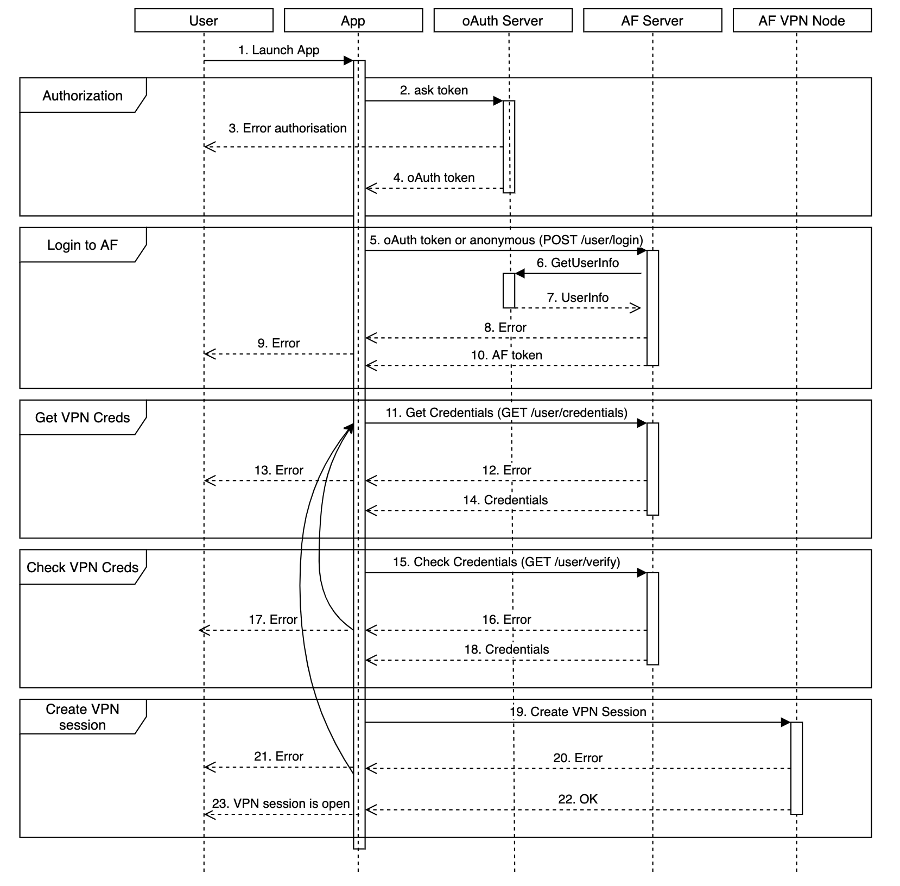

# What is Pango Platform

## What is Pango Platform

## With Pango Console you can:

1. Create projects for your applications with unique parameters. 
2. Manage users. 
3. See Dashboard with real-time data.

## What's more?

If you want to know if Pango Platform matches your needs :



The best way to discover Platform services is to try it out**:**

Check out our Frequently Asked Questions too:



## VPN Platform Flow

The Flow shows the interaction of the participants in the VPN channel establishment process between the user application and the platform's VPN node.

