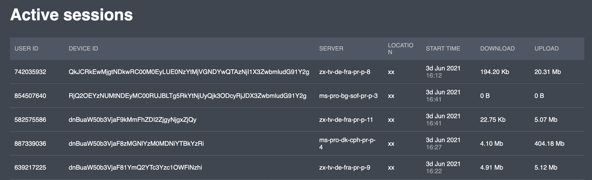

# Active sessions

This tab shows you the list of sessions that are active in the current project:


The list includes up to **5 000** active sessions


The list includes the following information:

| Parameter  | Description                                                                                           |
| ---------- | ----------------------------------------------------------------------------------------------------- |
| User ID    | unique user identifier (generated by the Platform)                                                    |
| Device ID  | unique device identifier (generated by the Platform)                                                  |
| Server     | Name of VPN node. It is the name of a server with a VPN tunnel between it and the user's device       |
| Location   | Location of the VPN server                                                                            |
| Start time | Session start time                                                                                    |
| Download   | Received amount of traffic (bytes are automatically converted to kilobytes, megabytes, and gigabytes) |
| Upload     | Sent amount of traffic (bytes are automatically converted to kilobytes, megabytes, and gigabytes)     |

## Actions

### User details

You can view all the data by selecting the corresponding session in the list. See the following document for details:


[user-page.md](users/user-page.md)


