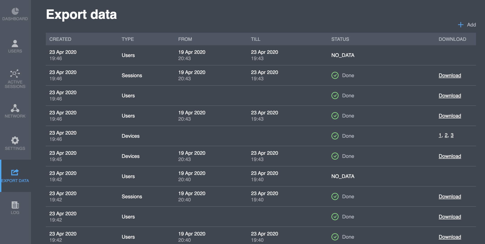
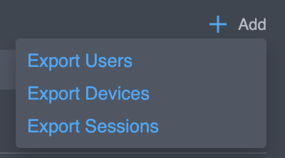
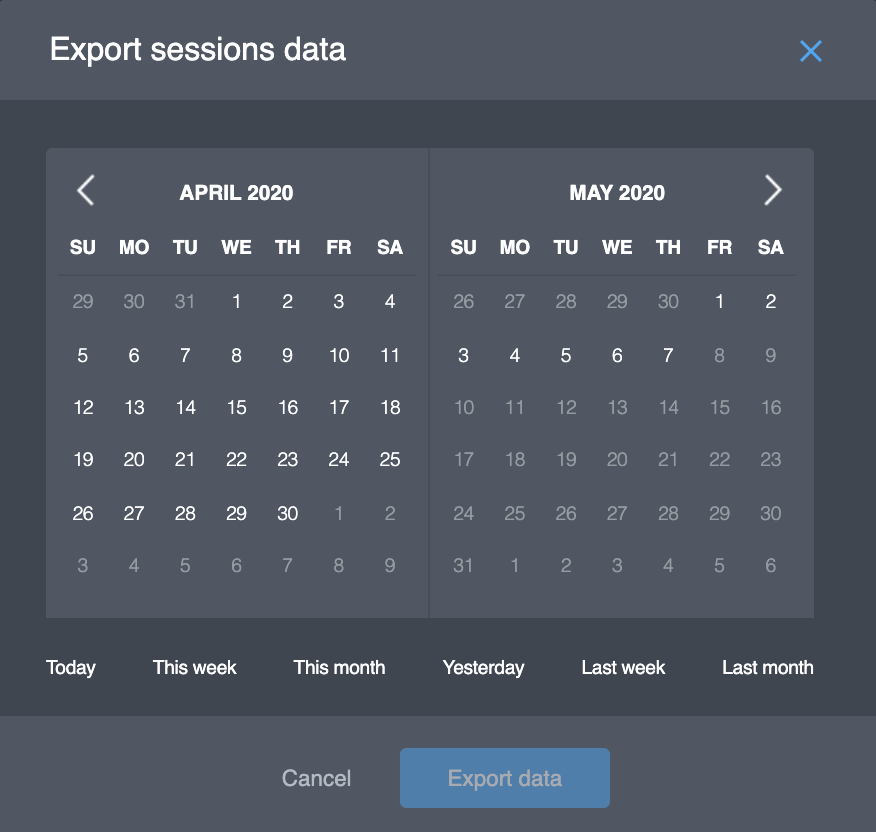

# Export Data

You can export 3 types of data:

* Project users \(all users\) 
* User's devices \(all devices\) 
* User's sessions \(period of 1-30 days\)

## Export history

The history of project data export is represented on the "Export data" page:

<table>
  <thead>
    <tr>
      <th style="text-align:left">Name</th>
      <th style="text-align:left">Description</th>
    </tr>
  </thead>
  <tbody>
    <tr>
      <td style="text-align:left">Created</td>
      <td style="text-align:left">Export task creation date</td>
    </tr>
    <tr>
      <td style="text-align:left">Type</td>
      <td style="text-align:left">
        
Type of data:

        <ul>
          <li>Users</li>
          <li>Devices</li>
          <li>Sessions</li>
        </ul>
      </td>
    </tr>
    <tr>
      <td style="text-align:left">From</td>
      <td style="text-align:left">Start date of the export period</td>
    </tr>
    <tr>
      <td style="text-align:left">Till</td>
      <td style="text-align:left">End date of the export period</td>
    </tr>
    <tr>
      <td style="text-align:left">Status</td>
      <td style="text-align:left">
        
Export status:

        <ul>
          <li><b>In progress</b> - a data export task in awaiting completion</li>
          <li><b>Done</b> - the process of data export is finished</li>
          <li><b>No data</b> - the Platform cannot find any data corresponding to the
            filter parameters</li>
          <li><b>Failed</b> - technical issue, contact us for details</li>
        </ul>
      </td>
    </tr>
    <tr>
      <td style="text-align:left">Download</td>
      <td style="text-align:left">Link on CSV file to download</td>
    </tr>
  </tbody>
</table>

## Actions

Select what type of data is going to be exported by clicking on "**Add**" button and choosing one option at a time.

A new export task will be created with "**In** _****_**progress**" status and displayed in the list. When processing of the task is complete, the status will change to either "**Done**", "**Failed**" or "**No Data**". In case of success, the link to the export file will appear in the "**Download**" column.


Failed tasks can be restarted


#### **Exporting Sessions**

To export session data, a date range must be selected. You can choose the range manually or use a preset \(Today, This week, This month, Yesterday, Last week or Last month\).  

