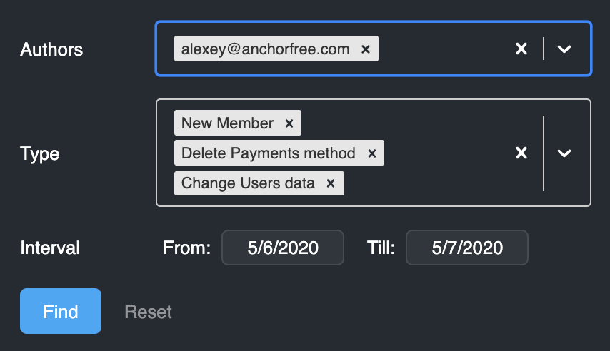

# Log

Logging interface contains a history of all project changes and represents it a table view, providing necessary filters and a download option.

## Log history

| Parameter | Description |
| :--- | :--- |
| Date | Date and time of a change |
| Author | Project member who made the change \(Subject\) |
| Type | Type of change \(Object\) |
| Changes | What was changed \(Value\) |

If you hover the cursor over _Changes_ cell, you can see detailed information, e.g.:

## Actions

### Filters

In the top-right corner, there is the filter option  . You can click it and change filter options.

| Filter Parameter | Description |
| :--- | :--- |
| Author | Project member who changed the project parameters. You can select multiple members from the list or / perform an input search. |
| Type | Types of changes. You can select multiple types from the list or / and perform an input search. |
| Interval | Date/s of changes. |

Select the parameters and click on the "**Find"** button. The results will be shown shortly.

You can clear all the parameters selected by clicking on "**Reset**" button.

### Downloading logs

In the top-right corner, there is the  "**Download"** button; clicking on it will cause a download of the represented log as a CSV file \(tab-delimited\) on your local drive.

