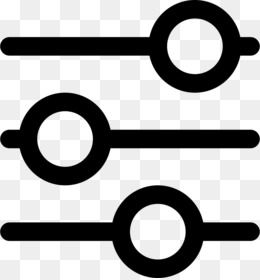

# Logs

All project changes are logged on this page.  

## Log history

| Parameter | Description |
| :--- | :--- |
| Date | Date and time of a change |
| Author | Project member who made the change |
| Type | Type of change |
| Changes | What was changed  |

If you hover the cursor over _Changes_ cell, you can see detailed information, e.g.:

## Actions

### Filters

In the top-right corner, there is the filter option  . You can click it and change filter options.

| Filter Parameter | Description |
| :--- | :--- |
| Author | Project member who changed the project parameters. You can select multiple members. |
| Type | Types of changes. You can select multiple types. |
| Interval | Date/s of changes. |

Select the parameters and click **Find**. The results will be shown shortly.

### Downloading logs

In the top-right corner, there is the  Download button. Click it and save the log as a CSV file.

