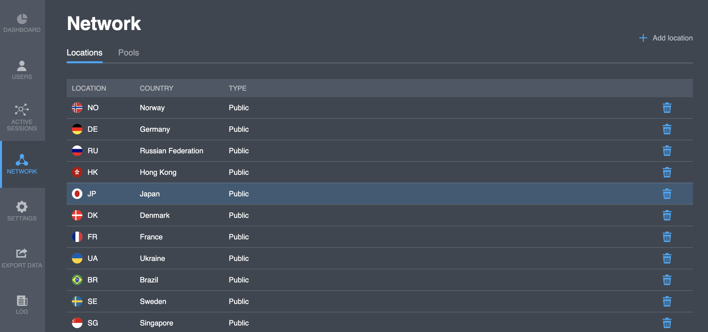

# Network locations

## Locations

This tab show you the locations list of the project. Same list you see if call API `GET`[`/user/countries`](https://backend.northghost.com/doc/all/index.html#!/user-controller/countryList) in your applications. Sample:  

<table>
  <thead>
    <tr>
      <th style="text-align:left">Parameter</th>
      <th style="text-align:left">Description</th>
    </tr>
  </thead>
  <tbody>
    <tr>
      <td style="text-align:left">Location</td>
      <td style="text-align:left">Country code ISO ALPHA-2</td>
    </tr>
    <tr>
      <td style="text-align:left">Country</td>
      <td style="text-align:left">Country name</td>
    </tr>
    <tr>
      <td style="text-align:left">Type</td>
      <td style="text-align:left">
        
Location type:

        <ul>
          <li>Public - VPN nodes, located in the current country</li>
          <li>Private - special for the project locations. Ask us for any details.</li>
        </ul>
      </td>
    </tr>
  </tbody>
</table>

## Actions

### Add location

You can add a location to your project. Steps to add a location:

1. Click "**Add location**" button. You will see the new line on the top list.
2. Click to the location field and select a country from the opened list of available new countries.

### Delete location

You can delete a location from your project. Steps to delete a location:

1. Select a location from the list for deleting.
2. Click "  " icon in the same line. 

