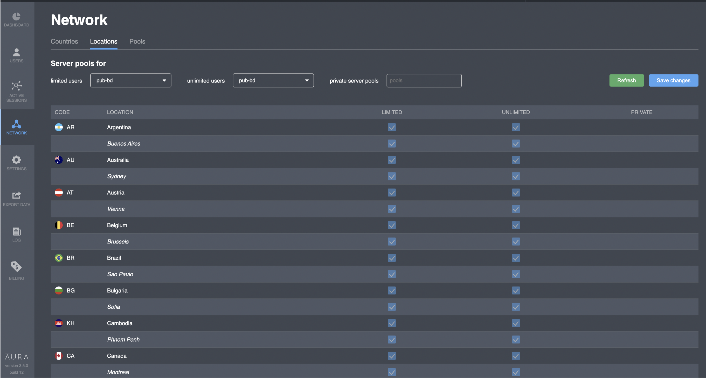

# Locations

## Overview

This screen is used for locations list configuration and view. However, you cannot manually switch flags \(limited/unlimited/private\) for any location in the table. Values of the table are calculated based on the pools selected.

| Parameter | Description |
| :--- | :--- |
| Code | Country code in [ISO ALPHA-2](https://en.wikipedia.org/wiki/ISO_3166-1_alpha-2) format |
| Location | Country name or _City name_ |
| Limited | Location is available for free users |
| Unlimited | Location is available for paid users |
| Private | Private location, specific for the project |

## Actions

### Refresh

You need to manually refresh the table after any changes in pool selectors have been made. This will works even if the "Save changes" button was not pushed.

### Save changes

You need to explicitly save any changes in pool selectors: 

* limited users
* unlimited users
* private server pools

