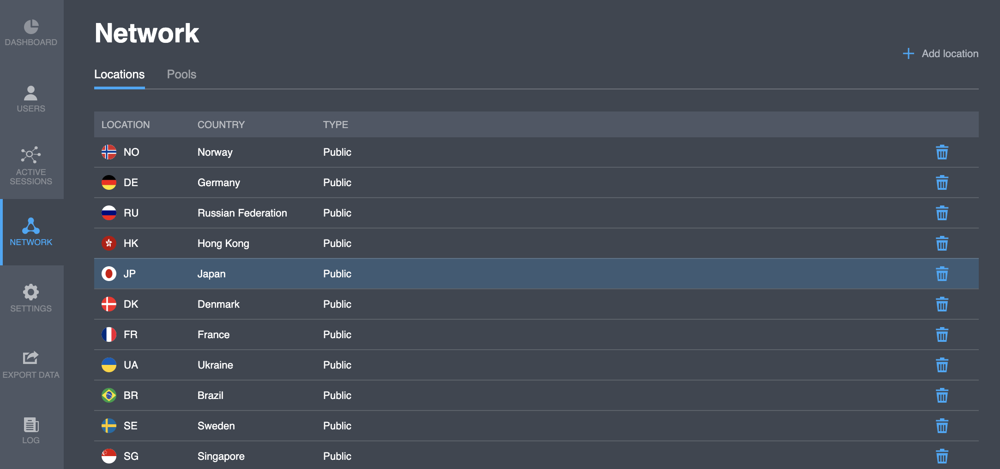

# Locations

This tab shows the list of project locations. You can access the same list if you call the API `GET`[`/user/countries`](https://backend.northghost.com/doc/all/index.html#!/user-controller/countryList) method in your applications.  

<table>
  <thead>
    <tr>
      <th style="text-align:left">Parameter</th>
      <th style="text-align:left">Description</th>
    </tr>
  </thead>
  <tbody>
    <tr>
      <td style="text-align:left">Location</td>
      <td style="text-align:left">Country code in <a href="https://en.wikipedia.org/wiki/ISO_3166-1_alpha-2">ISO ALPHA-2</a> format</td>
    </tr>
    <tr>
      <td style="text-align:left">Country</td>
      <td style="text-align:left">Country name</td>
    </tr>
    <tr>
      <td style="text-align:left">Type</td>
      <td style="text-align:left">
        
Location type:

        <ul>
          <li>Public - VPN nodes located in the chosen country</li>
          <li>Private - specifically for project locations. For details, contact us.</li>
        </ul>
      </td>
    </tr>
  </tbody>
</table>

## Actions

### Add location

You can add a location to your project:

1. Click the "**Add location**" button. You will see the new line at the top of the list.
2. Click the location field and select a country from the list of available new countries.

### Delete location

You can delete a location from your project:

1. Select a location you want to delete from the list.
2. Click the "  " icon in the same line. 

