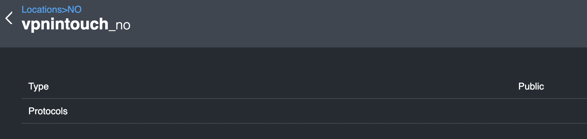

# Location details

This page shows more information about type and network protocols available for the specific location.

| Parameter | Description |
| :--- | :--- |
| Type | can be either **Public** \(default\) or **Private** |
| Protocols | a list of supported protocols |

