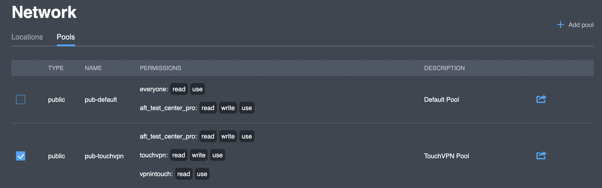
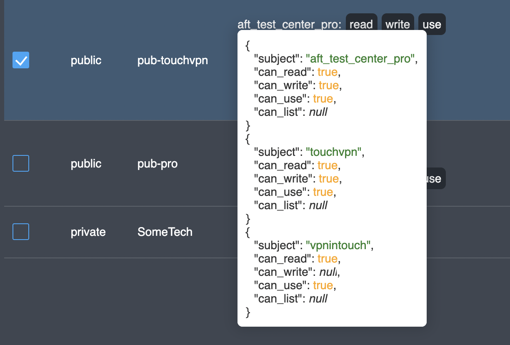
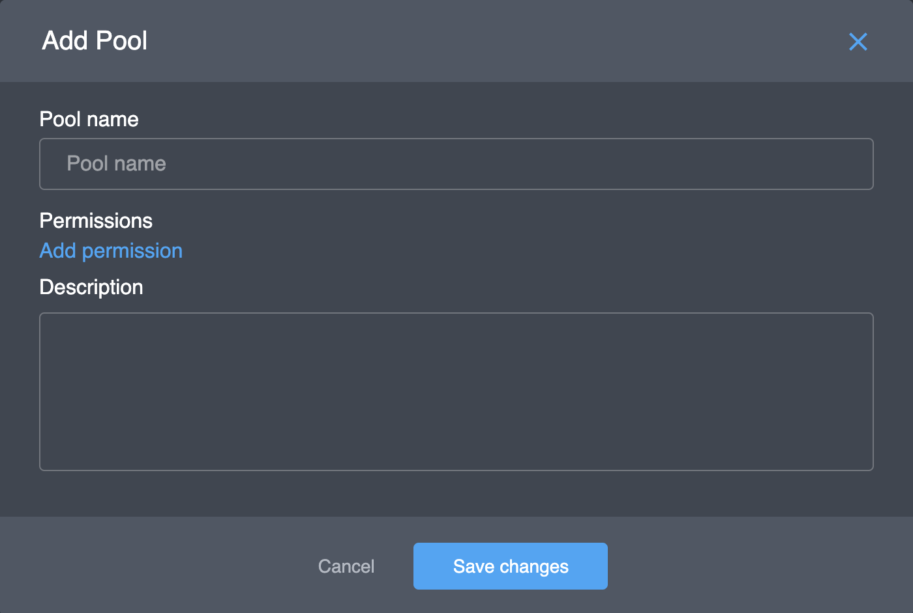
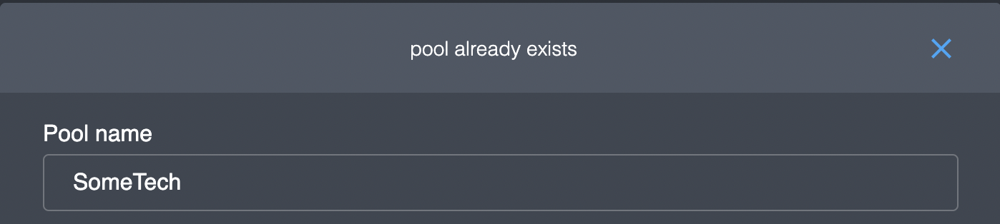
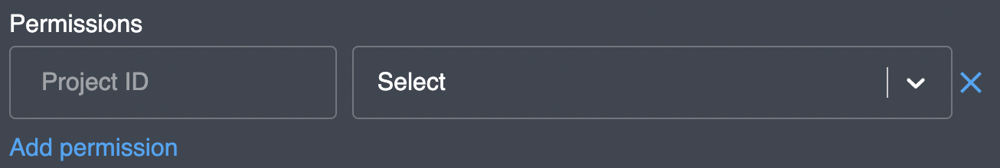
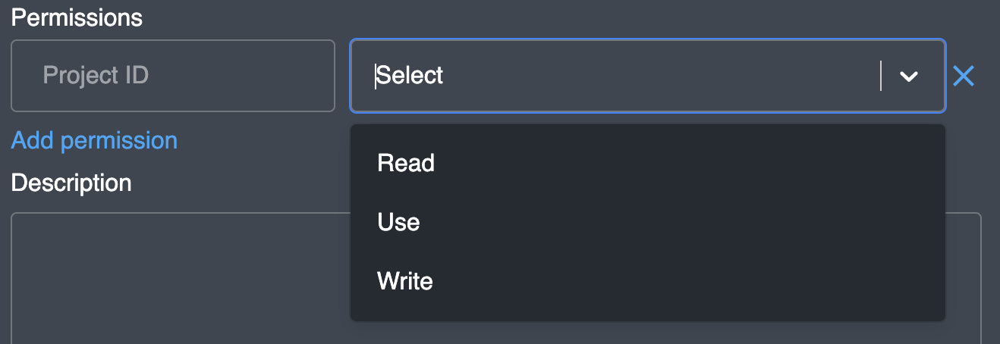
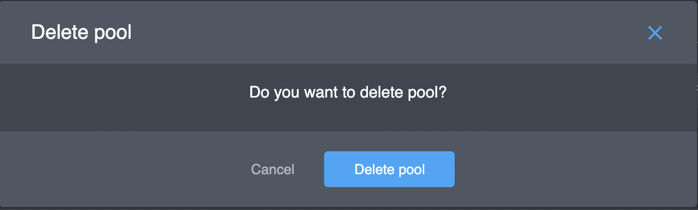

# Pools

## Overview

| Parameter | Description |
| :--- | :--- |
|  | to enable \(make it usable\) a specific pool |
| Type | to represent a pool type \(either **Public** or **Private**\) |
| Name | to identify the pool with a **unique** text label |
| Permissions | to specify which projects can **read**, **write**, **list** or **use** a pool |
| Description | to provide extra information on a pool \(optional\) |


You can have a JSON representation of pool settings by hovering the "**Permissions**" column and copy the text inside the tooltip


## Actions

### Add

You can add a new pool by clicking the "**Add pool**" button in the upper right corner; the corresponding dialog box will appear:


New pools are created **Public** by default. It's currently unavailable to change the type manually.


Pool **name** and **permissions** are mandatory to fill. Keep in mind that pool **name** is a **unique** identifier; attempting to use an existing name will result in an error "**Pool already exists**" and your pool will not be created:

Necessary permissions \(multiple\) should be chosen from the predefined list. The field supports text search:

Different set of permissions can be specified for several projects by clicking the "**Add** **permission**" button.

### Copy

Any pool from the list can be copied fully \(including type\) by clicking on  button. A postfix representing current time in [unix epoch format](https://en.wikipedia.org/wiki/Unix_time) \(e.g. _\_1622643592669_\) will be added to the new pool name.

### Edit

The edit screen repeats the add screen in terms of both the set of fields and the logic. This functionality is available by clicking on  button.

### Delete

Any pool supplied with  button can be deleted; a confirmation dialog will appear:

