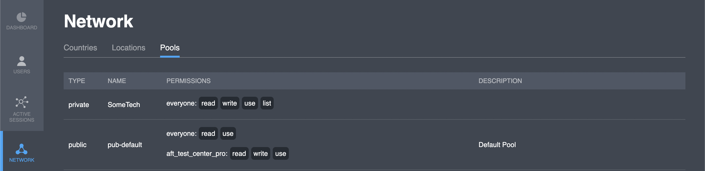

# Pools

## Overview

| Parameter   | Description                                                                    |
| ----------- | ------------------------------------------------------------------------------ |
| Type        | to represent a pool type (either **Public** or **Private**)                    |
| Name        | to identify the pool with a **unique** text label (no symbols allowed)         |
| Permissions | to specify which projects can **read**, **write**, **list,** or **use** a pool |
| Description | to provide extra information on a pool (optional)                              |

You can see the rule composition of the pool by clicking on the row.


[groups-of-pool.md](groups-of-pool.md)


## Actions

### Edit

The edit screen repeats the add screen in terms of both the set of fields and the logic. This functionality is available by clicking on the  button.

