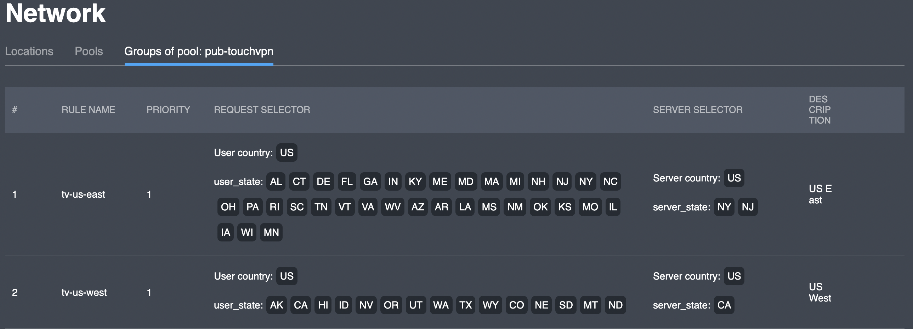

# Groups of pool

## Overview

This interface 


You can have a JSON representation of request selector by hovering a field in the "**Request selector**" column and copy the text inside the tooltip



You can get a JSON representation of server selector by hovering a field in the "**Server selector**" column and copy the text inside the tooltip


## Actions

### Add

You can add a rule to the pool by clicking the "**Add**" button in the upper right corner; the corresponding dialog box will appear:

### Edit

### Delete

