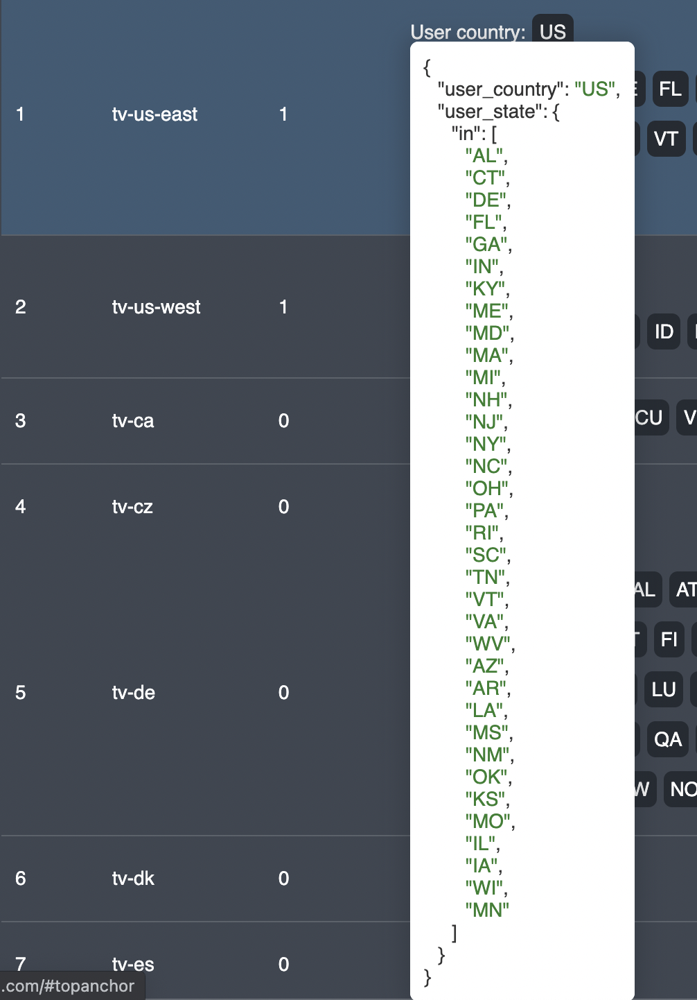
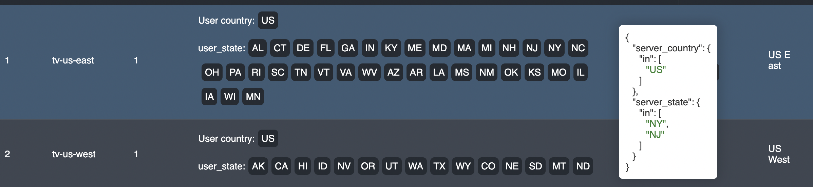
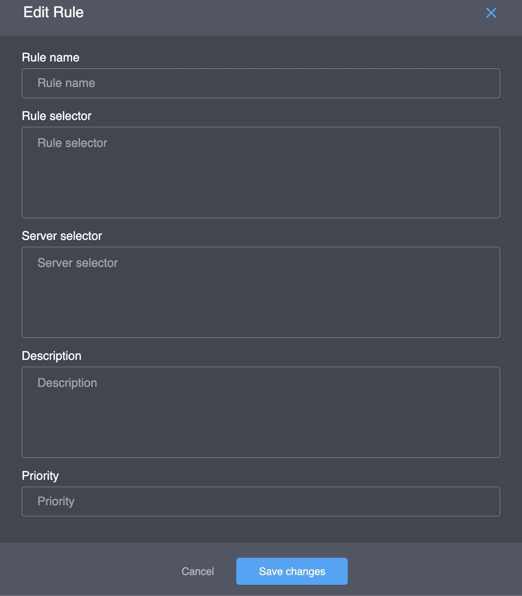

# Groups of pool

## Overview

This interface provides functionality for viewing and managing server location selection rules \(server selector\) depending on the client location \(request selector\).

| Parameter | Description |
| :--- | :--- |
| \# | a sequential number of the table entry |
| Rule name | a unique text identifier |
| Priority | lower value is processed first |
| Request selector | client location condition |
| Server selector | selected server location value |
| Description | extra information on the rule \(optional\) |


You can have a JSON representation of request selector by hovering a field in the "**Request selector**" column and copy the text inside the tooltip



You can get a JSON representation of server selector by hovering a field in the "**Server selector**" column and copy the text inside the tooltip


## Actions

### Add

You can add a rule to the pool by clicking the "**Add**" button in the upper right corner; the corresponding dialog box will appear:

| Parameter | Description |
| :--- | :--- |
| Rule name |  |
| Rule selector |  |
| Server selector |  |
| Description |  |
| Priority |  |

### Edit

### Delete

