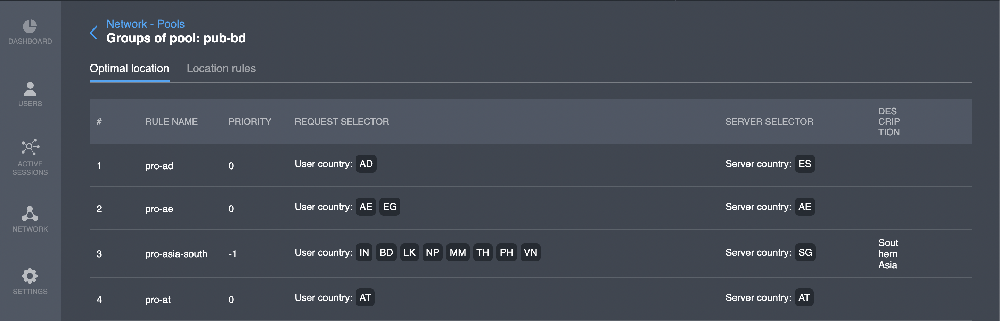

# Optimal location

## Overview

This interface provides functionality for viewing server location selection rules \(server selector\) depending on the client location \(request selector\).

| Parameter | Description |
| :--- | :--- |
| \# | Line number |
| Rule name | a unique text identifier |
| Priority | a lower value is processed first |
| Request selector | client current country condition |
| Server selector | selected server location value |
| Description | extra information on the rule \(optional\) |


Rules provided in this seciton are also added to the [general project configuration](https://pango.gitbook.io/pango-platform/console-details/project-settings/general/project-config-description-json-format)






