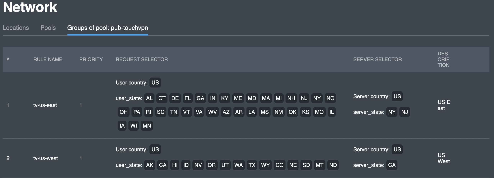

# Groups of pool

## Overview

This interface provides functionality for viewing and managing server location selection rules \(server selector\) depending on the client location \(request selector\).

| Parameter | Description |
| :--- | :--- |
| \# | a sequential number of the table entry |
| Rule name | a unique text identifier |
| Priority | lower value is processed first |
| Request selector | client location condition |
| Server selector | selected server location value |
| Description | extra information on the rule \(optional\) |


You can have a JSON representation of request selector by hovering a field in the "**Request selector**" column and copy the text inside the tooltip



You can get a JSON representation of server selector by hovering a field in the "**Server selector**" column and copy the text inside the tooltip


## Actions

### Add

You can add a rule to the pool by clicking the "**Add**" button in the upper right corner; the corresponding dialog box will appear:

| Parameter | Description |
| :--- | :--- |
| Rule name | a unique text identifier |
| Rule selector | a JSON structure |
| Server selector | a JSON structure |
| Description | \(optional\) |
| Priority | \(only digits\) |


Keep in mind that rule name is a **unique** identifier; attempting to use an existing name will result in an error "**Enter correct value**" and your rule will not be created






### Edit

The edit screen repeats the add screen in terms of both the set of fields and the logic. This functionality is available by clicking on  button.

### Delete

Any rule supplied with  button can be deleted; a confirmation dialog will appear:

