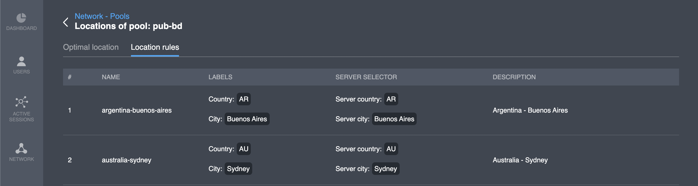

# Location rules

## Overview

This interface demonstrates server selection rules for specific locations \(**Locations** is different from **countries** mechanism and represented on [the respective page](https://pango.gitbook.io/pango-platform/console-details/network-locations/locations-1) of the Network section\)

| Column name | Description |
| :--- | :--- |
| \# | Line number |
| Name | Location code \(i.g. _country-city_\) |
| Labels | Country code and city name |
| Server selector | Server country code and server city |
| Description | General description |

