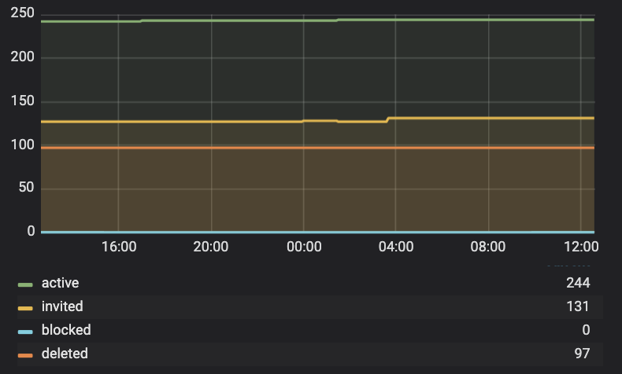
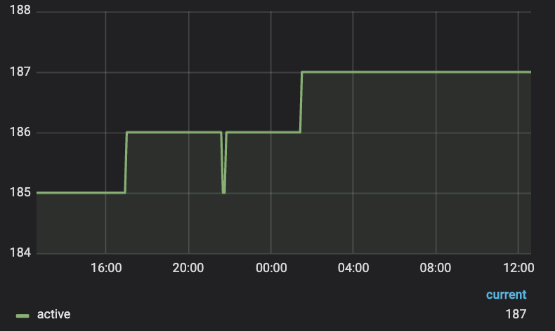
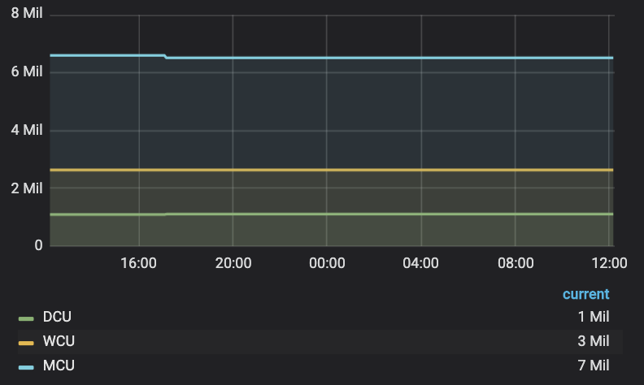
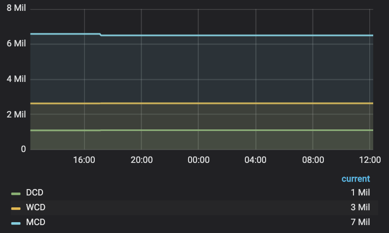
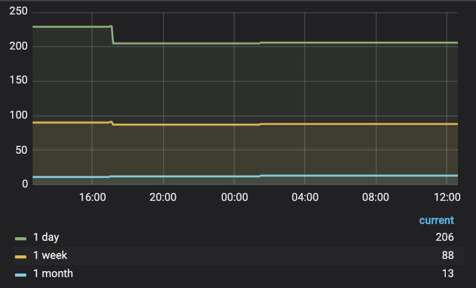
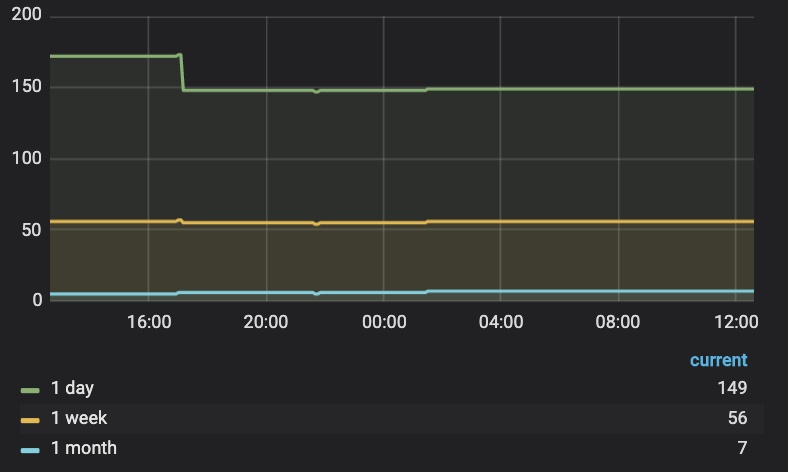

# General

## Graphs

### Active Sessions by Protocol

The graph “**Active Sessions by Protocol**” shows a realtime number of active sessions per VPN protocol. We use the most popular VPN protocols for iOS, Android, macOS, and Windows platforms like OpenVPN, IPSec, and also designed and patented by Pango HYDRA protocol which is more advanced and has higher performance benchmarks for now.

#### Details

We can see the active sessions per protocol just clicking the particular colored line on the graph and  check out how many sessions were active in particular time frame or even in an every single minute. It updates every 30 secs.

### Active Sessions by Locations

The graph show us amount realtime sessions per virtual location and we can see a very popular virtual location selected by users. For anonymous users that graph shows an Optimal server location.  

#### Details

Here we can see all  virtual location for all active users including anonymous users and users having a subscription. To look up a detailed list just click on the graph line and you can see pop up menu.To distinguish of any particular line  just click on the country code. The list of Virtual locations is scrollable.  It updates every 30 secs.

We are using ALPHA-2 codes for countries.

### Users

This graph will display active, invited and blocked users.  

#### Details

* **Active users** - Authorized in the project users.
* **Blocked users** - Users who have been disabled from the project.
* **Invited users** - Users who have been added to the project but have not logged into the application \(not authorized\).
* **Deleted users** - Users who have been deleted from the project.

### Devices

This graph displays the number of devices that are using actively using the application.  

#### Details

In the bottom right of the graphic shows the number of devices that are currently using the application.

### Daily, Weekly, Monthly Connected Users

This graph displays connected users on three lines, daily, weekly and monthly.

#### Details

The Legend:

* **DCU** = Daily Connected Users
* **WCU** = Weekly Connected Users
* **MCU** = Monthly Connected Users

It updates every 24 hours.

### Daily, Weekly, Monthly Connected Devices

This graph displays connected devices on three lines, daily, weekly and monthly.

#### Details

The Legend:

* **DCD** = Daily Connected Devices
* **WCD** = Weekly Connected Devices
* **MCD** = Monthly Connected Devices

It updates every 24 hours.

### Inactive Users

This graph displays all the inactive users for the day as well as the week and month.  

#### Details

It updates every 24 hours.

### Inactive Devices

This graph displays all the inactive devices for the day as well as the week and month.  

#### Details

It updates every 24 hours.

## Actions

### Filters

### Export data

