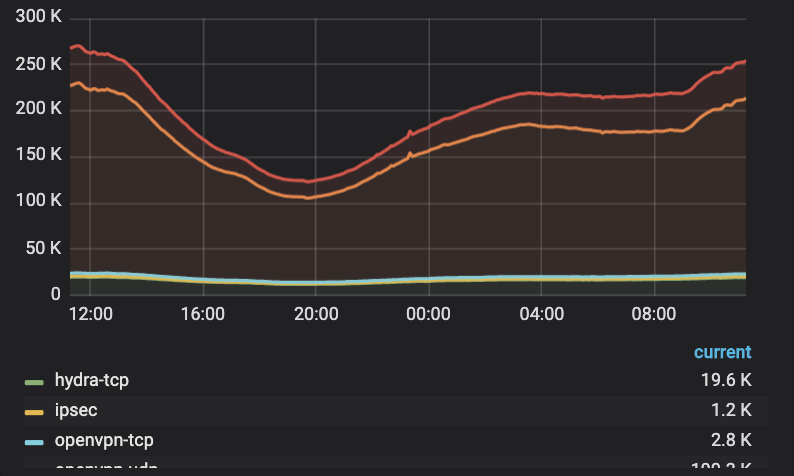
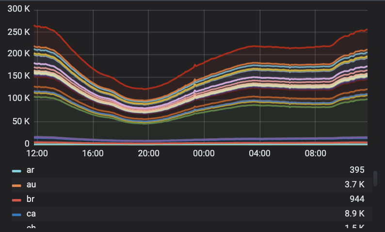

# General

## Graphs

### Active Sessions by Protocol

The graph “**Active Sessions by Protocol**” shows a realtime number of active sessions per VPN protocol. We use the most popular VPN protocols for iOS, Android, macOS, and Windows platforms like OpenVPN, IPSec, and also designed and patented by Pango HYDRA protocol which is more advanced and has higher performance benchmarks for now.

#### Details

We can see the active sessions per protocol just clicking the particular colored line on the graph and  check out how many sessions were active in particular time frame or even in an every single minute. It updates every 30 secs.

### Active Sessions by Locations

The graph show us amount realtime sessions per virtual location and we can see a very popular virtual location selected by users. For anonymous users that graph shows an Optimal server location.  

#### Details

Here we can see all  virtual location for all active users including anonymous users and users having a subscription. To look up a detailed list just click on the graph line and you can see pop up menu.To distinguish of any particular line  just click on the country code. The list of Virtual locations is scrollable.

### Users

### Devices

### Daily, Weekly, Monthly Connected Users

### Daily, Weekly, Monthly Connected Devices

### Inactive Users

### Inactive Devices

## Actions

### Filters

### Export data

