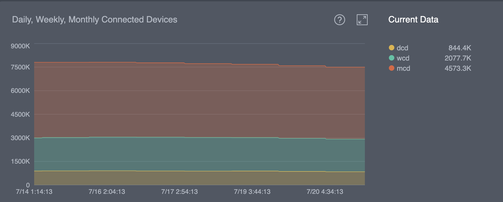

# General

## Graphs

### Active Sessions by Protocol

The graph “**Active Sessions by Protocol**” shows a realtime number of active sessions per VPN protocol. We use the most popular VPN protocols for iOS, Android, macOS, and Windows platforms like OpenVPN, IPSec, and also the HYDRA protocol, designed and patented by Pango, that is more advanced and has higher performance benchmarks in this day and age. &#x20;

.png>)

#### Details

We can see active sessions per protocol just by clicking particular colored lines in the graph and check how many sessions were active in a certain time frame or even in a certain minute. The graph updates every 30 secs.

### Active Sessions by Locations

The graph shows us the amount of real-time sessions per virtual location and you can see the more popular virtual locations chosen by users. For anonymous users, this graph shows an optimal server location. &#x20;

#### Details

There, we can see all virtual locations for all active users, including anonymous and paid users. To look up a detailed list, just click on the graph line and open a pop-up menu. To select a certain country, click the country code. The list of virtual locations is scrollable. It updates every 30 secs.

For countries, the ALPHA-2 codes are used.

### Users

This graph displays active, invited, blocked, and deleted users. &#x20;

.png>)

#### Details

* **Active users** - Users who are authorized in the project.
* **Blocked users** - Users who have been blocked from the project.
* **Invited users** - Users who have been added to the project but have not logged into the application (not authorized).
* **Deleted users** - Users who have been deleted from the project.

### Devices

This graph displays how many devices were actively using the application at a given moment. &#x20;

.png>)

#### Details

In the bottom right is a number of devices that are currently using the application.

### Connected Users

This graph displays the number of connected users daily, weekly, and monthly.

.png>)

* **DCU** = Daily Connected Users
* **WCU** = Weekly Connected Users
* **MCU** = Monthly Connected Users

The graph updates every 24 hours.

### Connected Devices

This graph displays connected devices daily, weekly, and monthly.

* **DCD** = Daily Connected Devices
* **WCD** = Weekly Connected Devices
* **MCD** = Monthly Connected Devices

The graph updates every 24 hours.

### Inactive Users

This graph displays inactive users in the current day, last week, and last month. &#x20;

.png>)

The graph updates every 24 hours.

### Inactive Devices

This graph displays all inactive devices in the current day, last week, and last month.

.png>)

This graph updates every 24 hours.

## Actions

### Filters

In the top right corner, there is the Filter button . You can click this button and change the time period of graphs' data - 1 day (default), 7 days, 14 days, 30 days, or Custom.

### Export data

If you want to export the data from the graphs, you can use the Export button  in the top-right corner or move to the 'Export Data' tab  in the left menu. You can see it in the next document:


[export-data.md](../export-data.md)


