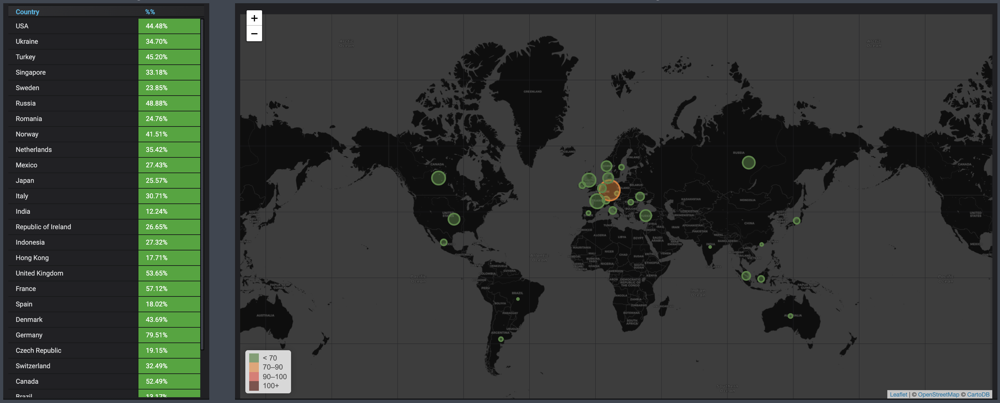

# Location Loading

This graph displays the location of highest usage.  The list of usage can be sorted by country or percentage by clicking on the title of the column.

## Graphs

### Location loading

This graph displays the location of highest usage. 

#### Details

The list of usage can be sorted by country or percentage by clicking on the title of the column.  
Red color \(100+\) shows us a problem with location. It means the bandwidth all servers of the location overloaded and need to add more new VPN-nodes to this location.

