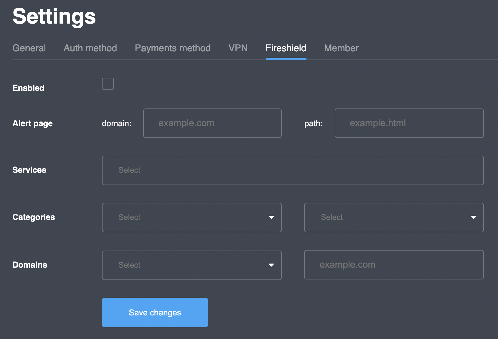

# Fireshield

## Overview

Fireshield is a network security service; turned on, it will check all project users' IP and DNS requests through a categorized database in order to determine if the web resource is safe/unsafe to communicate with and process it according to the configured rules.

 (2).png>)

* **Enabled** - a switch to turn Fireshield on (ticked) / off (empty)
* **Alert page** - a special web page to redirect a user in case a fireshield protection worked (e.g. with an explanation why a website user have tried to reach is blocked)
  * **domain** - an actual domain name of the web-site (e.g. example.com)
  * **path** - a path to the particular page on the web-site (e.g. example.html)
* **Services** - a list of database sources used to determine if the resource is safe/unsafe
  * **securityzones** - synchronized every 5 minutes
  * **ip** - technical entry (required for proper Bitdefender service work)
  * **bitdefender** - requested in real time and supplemented with 30 minutes lifetime cache (can be cleared earlier if the number of records is more than 20 000)
* **Categories** - a list of pre-determined web-resource categories with general **safe**/**unsafe** and more specific:
  *   **unsafe:malware** - a list of websites that may try to setup a malicious

      software on user's computer in order to spy or cause damage
  * **unsafe:untrusted** - a list of suspicious and not trustworthy sites
  * **unsafe:trackers** - a list of sites that mark a browser in order to gather information about user's activity over the Internet
  * **unsafe:phishing** - a list of sites suspected of cybercrime in which a target or targets are contacted by someone posing as a legitimate institution to lure individuals into providing sensitive data such as personally identifiable information, banking, and credit card details, and passwords
  * **custom** - an extra category of user-defined purpose


Rules configured for the general **unsafe** category apply to all **unsafe:\*** categories


* **Domains** - a mechanism to add custom domain names to the specific category (for the current project only)
