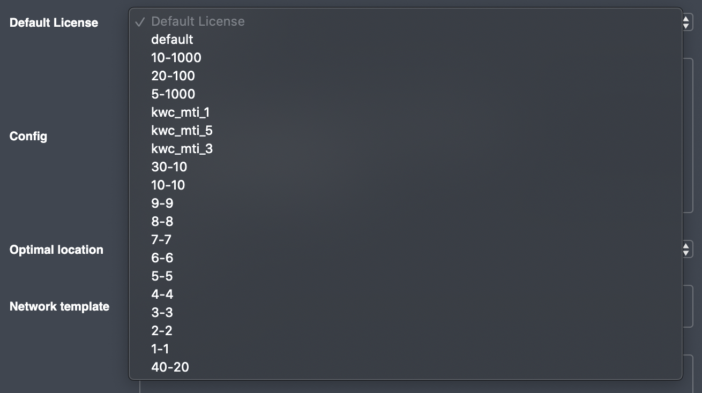
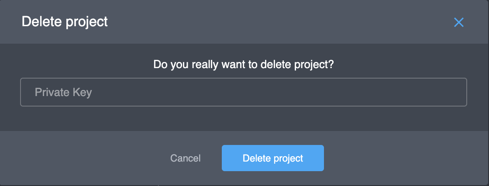

# General

### General parameters

To log into your project, you should use the Project ID. You can see the Project ID in the top left under the project name \(_"sbe\_tranquility"_ in this example\):

Then, go to the _"Settings"_ menu item and choose the _"General"_ tab. The parameters are as follows:

* **Private Key** - a password of the Partner API.
* **Company name** - the name of a project owner's company.
* **Type** - the project type. 
* **Bandwidth type** - The type of bandwidth limitation. By default, the type is "_By user_". It means the Platform will calculate the bandwidth amount like the sum of all the traffic user's devices used. Another Bandwidth type is "_By device_". The Platform will calculate the bandwidth amount separately per each user device. For details, contact us.
* **Default Bandwidth limit \(MB\)** -  the daily bandwidth limit for newly registered users. For example, if you see it to 100, newly registered users will have a 100MB daily limit. If this parameter will empty, newly registered users will have an unlimited daily limit.
* **Default License** - you can select the default license for newly registered users. Below is the list of licenses:  

Each license has 2 parameters. The first parameter is the devices limit, the second parameter - the concurrent sessions limit \(not used anymore\). For example, the license "20-100" sets the following limits to a user: 20 devices and 100 concurrent sessions. The "_default_" license sets no limit on the number of devices and concurrent sessions.

* **Config** - you can see and change the specific project parameters \(JSON format\). Details:



* **Optimal location** - this parameter switches the "Optimal location" setting for this project on or off. By default, this parameter is switched on \("_enabled_"\). As a result, your application will ask credentials without the "_Location_" parameter. The Platform will provide the optimal \(nearest\) VPN nodes for connecting. If this parameter is set to "_disabled_", you should set location for any credentials request. A request for credentials without the location parameter will return the error.
* **Network template** - not used anymore.
* **Description** - text description of the project. 
* **Icon** - you can set the icon for the project. You can see this icon in the list of projects.

### Actions

* **Upload image** - click the button and select a file to upload \(see parameter "**Icon**"\).
* **Save changes** - click the button to save all changes on the General screen.
* **Delete project** - click the button to delete the project. For the approval of this action you should manually input the Private Key \(see parameter "Private Key"\) and click the "Delete project" button:


**Caution**: this action is **irreversible**


