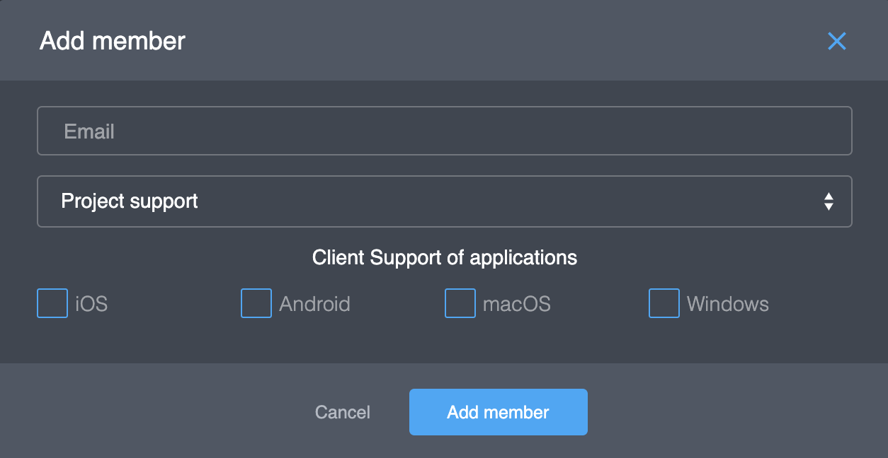

# Member

The Project Member is a person who has access to the Platform Console. There are 3 roles with different privileges:

| Role | Access  |
| :--- | :--- |
| Owner | full access |
| Admin | can't delete a project |
| Support | can't change project settings |

## Actions

### Adding a new member

If you want to add a new member to the project, do the following:

1. Click "**Add member**". You will see a form that looks like this:

  2. Enter the email address of the user.


If this user has access to the Platform Console, he will see this project in his list of projects. If this user is new, the Platform will send an invitation.


  3. Select a member's role. 


A member can't add a new member with a role higher than his own role.


  4. If you want this new member to help other users with technical issues, select clients that the user will receive emails from.


Our SDK provides this member's email to an application \(per OS\). Your application can use this email to contact support.


  5. Click **Add member**.

### Editing a member

If you want to change settings of an existing member, do the following:

1. Select a member and click . You will see a form that looks like this:  

  2. Edit settings and click **Save changes**. 

### Deleting a member

If you want to delete an existing member, do the following:

1. Select a member to delete and click . You will see a form that looks like this:

   2. Click **Delete member**. 

