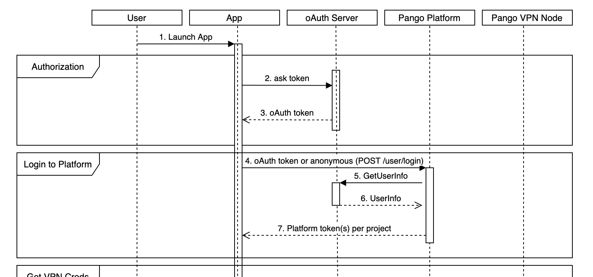

# Auth Plugin requirements

You need a plugin if your application uses another authentication service, not supported by the Platform  authorization methods.

We can make a plugin for any authentication service compatible with the following flow:  



This is a piece of the full Flow diagram:



_**oAuth Server**_ - your User authentication service.

_**App**_ - your application with our SDK

**1st phase \(Authorization\)**: A user authentication to the oAuth Server. The App gets an oAuth token \(**Steps 1-3** in the Flow diagram\).

**2nd phase \(Login to Platform\)**: 

**Step 4**: The App calls a POST __`/user/login` method \(or calls a login method of our SDK\) with the parameter "_auth\_method_" = your plugin name and "_access\_token_" = oAuth token. 

**Step 5**: The Platform verifies this oAuth token in your oAuth Server. In this step, the "GetUserInfo \(_oauth\_token\)"_ method is called \(its name can be changed\). __You should provide this method for us.

**Step 6**: The example of the response to this method: 

```text
{ 
  "result": "OK", 
  "user": 
    { 
      "uid": 690109944 
    } 
}
```

or

```text
{ 
  "result": "Not found" 
}
```

If a user's oAuth token verification is successful, the response includes {"result": "OK"} and additional user information \(e.g., UID on your side\). If a user's oAuth token verification is unsuccessful, the response is {"result": "Not found"} or any similar response. 

**Step 7**:  If the verification is unsuccessful, the Platform returns an error code:

```text
{
  "result": "OAUTH_ERROR",
  "error": "failed login"
}
```

If the verification is successful, the Platform registers the user and his device in the project. The process of registration can include set specific user parameters like _Traffic_, _License_, _Status_, _Extref_, _Description_, _User country_ \(it depends on your application logic\)_._ See descriptions of these parameters:


