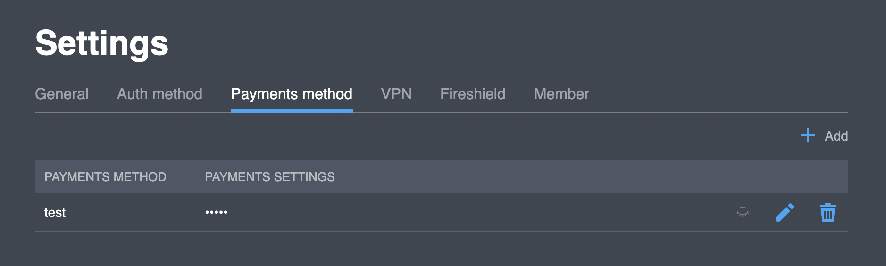

# Payment methods

## Overview


**Payments settings** column values are masked by default. You can reveal the real value by clicking on the  button and hide it back by clicking on the  button


## Purchase flow

### First purchase

* When a user is authorized and logged in to your application, their user state is “free” with a traffic limit.
* A user purchases an in-app subscription, e.g., an in-app purchase on Android Play or Apple Store.
* The application calls a POST method [`/user/purchase`](https://backend.northghost.com/doc/user/index.html#!/user-controller/sendPurchase) \(the same method in SDK\) and sends a purchase receipt to the Platform.
* The Platform verifies the purchase in the Purchase service \(e.g., in Android Play or Apple Store\).
* If the purchase is valid, the Platform removes the traffic limit for the user.

### After the first purchase

* The Platform will call the Purchase service once a day per user to verify each purchase. 
* If the purchase is invalid, the traffic limit is returned.

The process described above will be based on the Platform's _user\_id_, user's unique identifier.

## Payment methods in your project



## Actions

### Add new method

If you are going to add a new user payment method to the project, do the following:

1. Click the "**Add**" button. You will see a form that looks like this:  

Fill in the name and settings of your payment method.

1. Click "**New payments method**". The result can be seen in the table, for example:  

### Edit method parameters

If you are going to change the settings of an existing payment method, do the following:

1. Select a payment method and click the "" button. You will see a form that looks like this:  

1. Edit the JSON and click "**Edit payments method**". 

### Delete a method

If you are going to delete an existing payment method, do the following:

1. Select a payment method and click the "" button. You will see a form that looks like this:  

1. Click "**Delete payments method**". 

