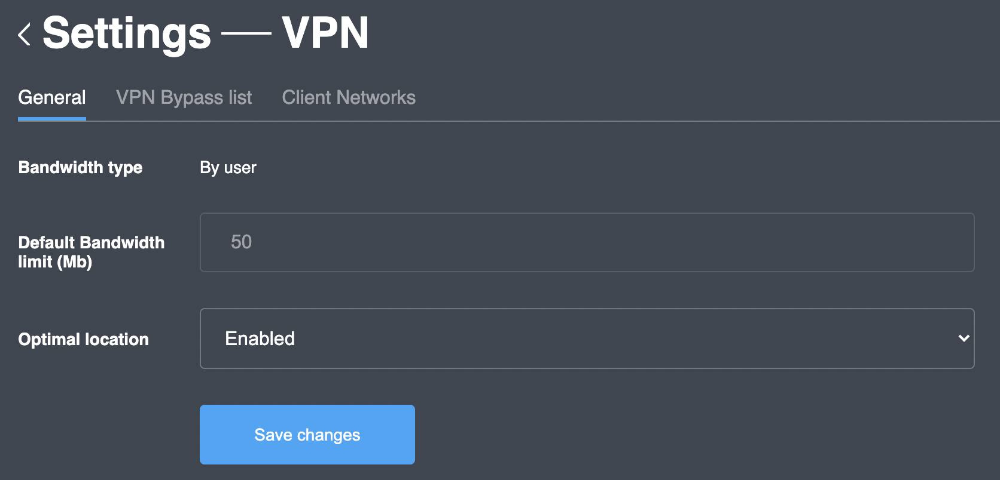

# General

### Overview

General VPN settings allow to configure:

| Field name | Purpose |
| :--- | :--- |
| Default bandwidth limit | To specify a maximum data transfer rate \(in megabytes\) |
| Bandwidth type | To choose how bandwidth limit should be to applied \(currently  restricted to only "by user"\) |
| Optimal location | To turn on / off determination of optimal VPN server \(best connection speed to the current user\) |

