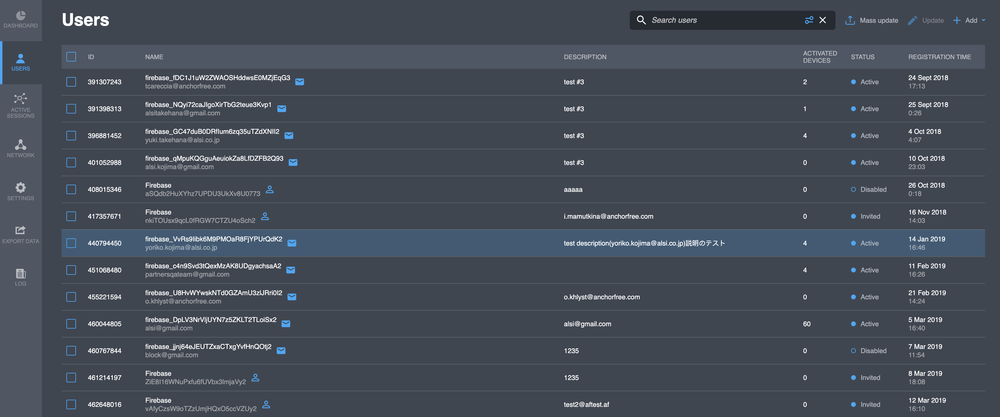
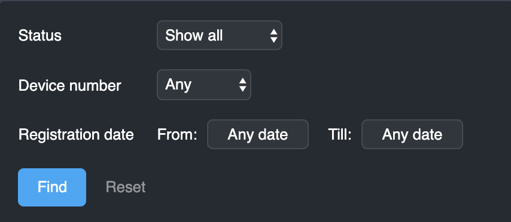
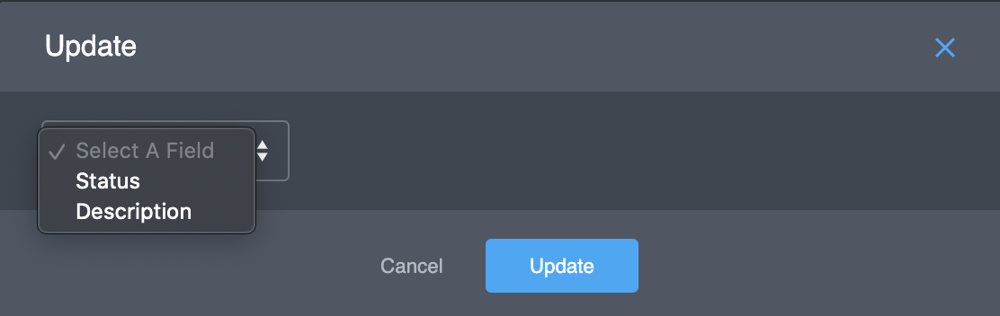
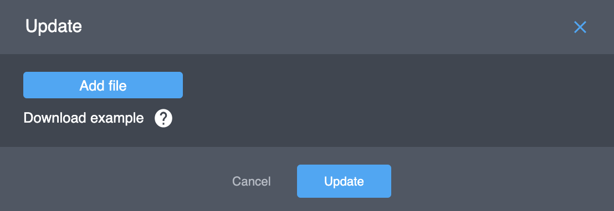
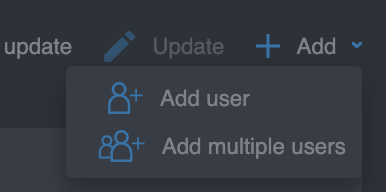
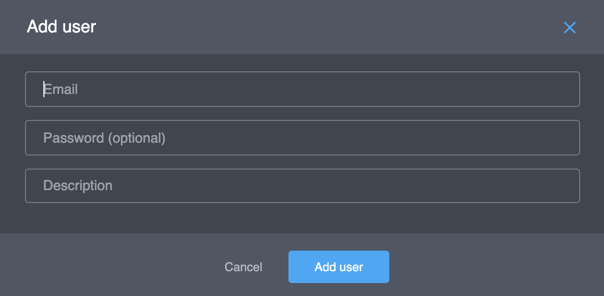
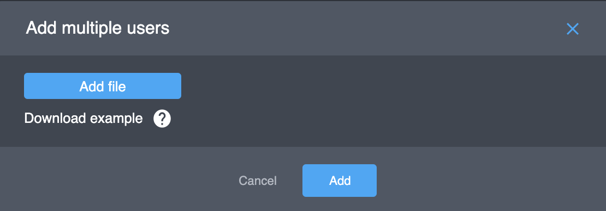
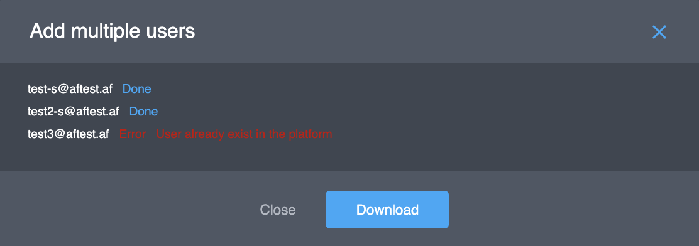

# Users

This tab shows you the list of users in the project, e.g.:  

<table>
  <thead>
    <tr>
      <th style="text-align:left">Parameter</th>
      <th style="text-align:left">Description</th>
    </tr>
  </thead>
  <tbody>
    <tr>
      <td style="text-align:left">
        Checkbox</td>
      <td style="text-align:left">Checkbox for <em>Update</em> and <em>Mass update</em> actions. See these actions
        below. This parameter does not exist for <em>&quot;Public VPN&quot;</em> and <em>&quot;Proxy&quot;</em> projects.</td>
    </tr>
    <tr>
      <td style="text-align:left">ID</td>
      <td style="text-align:left">User ID, generated by the Platform</td>
    </tr>
    <tr>
      <td style="text-align:left">Name</td>
      <td style="text-align:left">
        
User&apos;s unique key. The Name includes the type of user authentication
          and the user id of the authentication service. For example:

        <ul>
          <li><em>firebase_jfqmTeaifwPNuOwIofHHdhY89Po1</em>
            <ul>
              <li><em>firebase</em> - user authorized by Firebase authentication type,</li>
              <li><em>jfqmTeaifwPNuOwIofHHdhY89Po1</em> - user id in the Firebase auth.</li>
            </ul>
          </li>
          <li><em>anonymous_KhmGS8nxiPQ0Cf0ZCApA3VBF8uS2</em>
            <ul>
              <li>anonymous - user authorized via Anonymous authentication,</li>
              <li>KhmGS8nxiPQ0Cf0ZCApA3VBF8uS2 - randomly generated User ID in the Platform</li>
            </ul>
          </li>
        </ul>
      </td>
    </tr>
    <tr>
      <td style="text-align:left">Description</td>
      <td style="text-align:left">(optional) Additional information about the user.</td>
    </tr>
    <tr>
      <td style="text-align:left">Activated devices</td>
      <td style="text-align:left">Amount of users&apos; activated devices.</td>
    </tr>
    <tr>
      <td style="text-align:left">Status</td>
      <td style="text-align:left">User&apos;s status (<b>Active</b> or <b>Blocked</b>)</td>
    </tr>
    <tr>
      <td style="text-align:left">Registration time</td>
      <td style="text-align:left">Date and time of a user&apos;s registration</td>
    </tr>
    <tr>
      <td style="text-align:left">Purchases</td>
      <td style="text-align:left">Payed or Free user. This parameter does not exist for &quot;Business VPN&quot;
        projects.</td>
    </tr>
  </tbody>
</table>

## Actions

### User search

In the top right corner, there is the _Search_ _Users_ option. You can click this button and change filter options.

If your project type is _"Public VPN"_, you can see the following search field in the top-right corner of the screen: 

Click _"User ID"_ and select a search parameter. There are the following search parameters:

* _User ID_,
* _User Name_,
* _User Token_,
* _Device ID_.

You can use only one search parameter simultaneously.

If your project type is _"Private VPN"_, you can see the following search field in the top-right corner of the screen:

You can use the following search parameters:

* User ID,
* User Name,
* User Description,
* User Token,
* Device ID. 

At the same time, if you click  you can set additional options   

### Update

Update option is available for _"Private VPN"_ projects only. You can change several user parameters of selected users \(using the checkbox\) and click the _Update_ optionin the top-right corner of the screen. 

You can update _Status_ and _Description_ fields_._ Select a __field, set a parameter and click the _"Update"_ button.


If you need to change other parameters of the user, you need to open the detailed user data and change desired parameters there.


### Mass update

Mass update option is only available for _"Private VPN"_ projects. This option is similar to the _"Update"_ option but it accepts .CSV \(Comma Separated Value\) files. To ****perform a mass update, a .CSV file with the updates in it should be uploaded. Notice that only the _'Description'_ and _'Status'_ fields can be modified. The template is as follows: 

| User name | Description | Status |
| :--- | :--- | :--- |

Click the '_Mass update'_ button in the top-right corner of the screen.  

Upload the file by clicking on the _'Add file'_ button and select the file. Click the '_Update'_ button to update the users.

### Add user

This option is only available for _'Private VPN'_ projects. 

You can add a user to your project:

1. Click _'__Add'_ button and select _'Add user'_

    2. Fill the form:

* Email - user email.
* Password - user password \(optional\). 
* Description - user details \(optional\), e.g. their full name.

  3. Click button _'Add user'_.

As a result, you will see a new user in the list. The user's status will be _'Invited'_. When the user logs in to the project for the first time, his status will be changed to _'Active'_.

If the password field was empty, the Platform will send an email to the user with a link to set a password. This link will expire in a few hours. If the link expired, the user can go to [https://developer.anchorfree.com/\#auth/signin](https://developer.anchorfree.com/#auth/signin) and reset the password again. As a result, he will receive an email with a new link.

### Add multiple users

This option is only available for _'Private VPN'_ projects. 

You can add multiple users to your project:

1. Click 'Add' button and select _'Add multiple users_'

  2. Fill the form:

  3. Click _'Add file'_ and select the .CSV file with the users in it.


Click _'Download example'_ to download a sample .CSV file.


  4. Click the _'Add'_ button. The Platform will attempt to add users to the project and give you the summary:

You can download the results and close this form.

### User details

All user data can be seen if you click the user in the list of users. See the next document about this.

