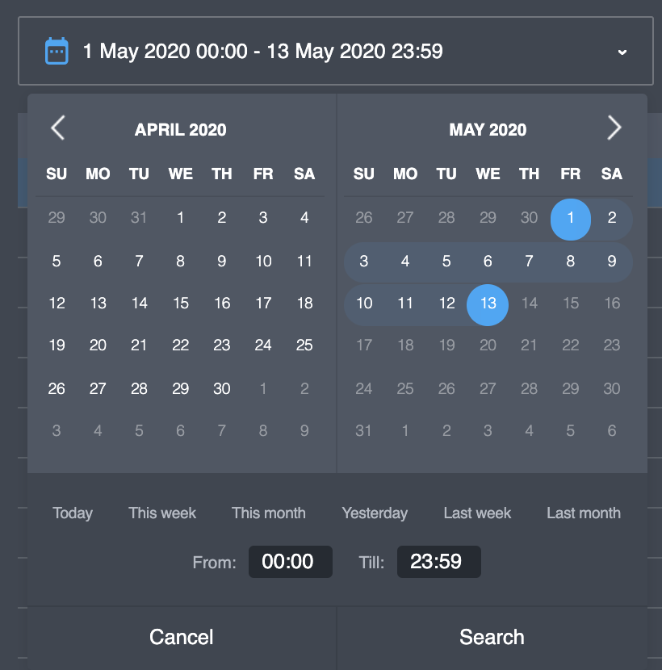
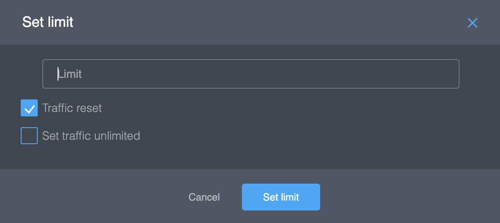

# User page

## General data

General user data includes next information:

<table>
  <thead>
    <tr>
      <th style="text-align:left">Parameter</th>
      <th style="text-align:left">Description</th>
    </tr>
  </thead>
  <tbody>
    <tr>
      <td style="text-align:left">Traffic</td>
      <td style="text-align:left">User daily bandwidth limit (Mb). If the user doesn&apos;t have a bandwidth
        limit, you will see &quot;<em>Unlimited</em>&quot;. You can change the
        user bandwidth limit (see actions on this page).</td>
    </tr>
    <tr>
      <td style="text-align:left">License</td>
      <td style="text-align:left">User license. The license determines how many devices a user can register.
        You can change the license (see actions on this page).</td>
    </tr>
    <tr>
      <td style="text-align:left">Activated devices</td>
      <td style="text-align:left">Amount of registered devices</td>
    </tr>
    <tr>
      <td style="text-align:left">Status</td>
      <td style="text-align:left">
        
User status:

        <ul>
          <li>Invited - registered to the project but newer login.</li>
          <li>Active - active user.</li>
          <li>Disabled - blocked user. The user can&apos;t use the Platform services.</li>
        </ul>
      </td>
    </tr>
    <tr>
      <td style="text-align:left">Registration time</td>
      <td style="text-align:left">User registration in the project time.</td>
    </tr>
    <tr>
      <td style="text-align:left">Purchases</td>
      <td style="text-align:left">This parameter exist only for users of &quot;<em>Public VPN</em>&quot;
        projects. If a user has active subscription the parameter will have &quot;<em>Active</em>&quot;
        status.</td>
    </tr>
    <tr>
      <td style="text-align:left">Extref</td>
      <td style="text-align:left">Additional parameter. It can include any data, for example, User ID of
        your external service. You can change this data (see actions on this page).</td>
    </tr>
    <tr>
      <td style="text-align:left">Description</td>
      <td style="text-align:left">User description, for example, user full name. You can change this data
        (see actions on this page).</td>
    </tr>
    <tr>
      <td style="text-align:left">User country</td>
      <td style="text-align:left">Original user country. You can change this data (see actions on this page).</td>
    </tr>
    <tr>
      <td style="text-align:left">Auth method</td>
      <td style="text-align:left">Name of the Authentication method for this user.</td>
    </tr>
  </tbody>
</table>## Sessions

All sessions of the user you can found in this page. This page include the list of sessions and the search filter.

| Parameter | Description |
| :--- | :--- |
| Device ID | Device ID, generated by Platform. |
| Server | Name of VPN node. VPN session active between the user device and this server. |
| Location | Location of the VPN server. |
| Start time | Session start time. |
| End time | Session end time. If the session is active, this field will be empty. |
| Internal IP | Internal IP address this session \(VPN node assigns the IP for this session\). This IP is not a real user's IP or user external IP. |
| Download | Receive bites |
| Upload | Transmit bites |

You can sort the list data by any column.


Active sessions you will see on top the session list.


In the top, there is the filter option. You can filter the session list by user device or session time.


Filter time period for sessions can be up to 30 days.


## Devices

All user devices you can found in this page. This page include the list of devices.

<table>
  <thead>
    <tr>
      <th style="text-align:left">Parameter</th>
      <th style="text-align:left">Description</th>
    </tr>
  </thead>
  <tbody>
    <tr>
      <td style="text-align:left">Device ID</td>
      <td style="text-align:left">Device ID, generated by Platform.</td>
    </tr>
    <tr>
      <td style="text-align:left">Access Token</td>
      <td style="text-align:left">Device secret, generated by Platform.</td>
    </tr>
    <tr>
      <td style="text-align:left">Name</td>
      <td style="text-align:left">Device name</td>
    </tr>
    <tr>
      <td style="text-align:left">Device Type</td>
      <td style="text-align:left">
        
Device type:

        <ul>
          <li>Android</li>
          <li>iOS</li>
          <li>macOS</li>
          <li>Windows</li>
        </ul>
      </td>
    </tr>
    <tr>
      <td style="text-align:left">Registration Time</td>
      <td style="text-align:left">Device registration time</td>
    </tr>
  </tbody>
</table>You can delete a user device  \(see actions on this page\).

## Purchases

All user subscription you can found in this page. This page include the list of subscriptions.


This page available only in "_Public VPN_" projects.


<table>
  <thead>
    <tr>
      <th style="text-align:left">Parameter</th>
      <th style="text-align:left">Description</th>
    </tr>
  </thead>
  <tbody>
    <tr>
      <td style="text-align:left">Transaction ID</td>
      <td style="text-align:left">Purchase transaction ID</td>
    </tr>
    <tr>
      <td style="text-align:left">Product ID</td>
      <td style="text-align:left">Purchase product ID</td>
    </tr>
    <tr>
      <td style="text-align:left">Type</td>
      <td style="text-align:left">
        
Purchase type:

        <ul>
          <li>apple</li>
          <li>google</li>
          <li>...</li>
        </ul>
      </td>
    </tr>
    <tr>
      <td style="text-align:left">Transaction Time</td>
      <td style="text-align:left">Purchase transaction time</td>
    </tr>
    <tr>
      <td style="text-align:left">Expiration Time</td>
      <td style="text-align:left">Purchase expiration time</td>
    </tr>
    <tr>
      <td style="text-align:left">Active</td>
      <td style="text-align:left">Active purchase or not</td>
    </tr>
    <tr>
      <td style="text-align:left">Trial</td>
      <td style="text-align:left">Trial period active or not</td>
    </tr>
    <tr>
      <td style="text-align:left">Raw Data</td>
      <td style="text-align:left">Raw purchase data in JSON format</td>
    </tr>
  </tbody>
</table>You can deactivate active purchase and try to activate no-active purchase \(see actions on this page\).

## Actions

### Change the user bandwidth limit

For change parameters "_Traffic_" you need to 

1. Open User _General_ tab 
2. Click to  edit icon near the field.

3. In this form you can 

* set any daily limit \(bites\),
* set checkbox "_Traffic reset_". Actual daily limit will reset to 0 after the limit update.
* set the user unlimited.

  4. Click the "_Set limit_" button for update.

### Change the license

For change parameters "_License_" you need to 

1. Open User _General_ tab 
2. Click to  edit icon near the field.
3. Select new license from list of available licenses and click the "_Save_" button for update.


The license name usually includes 2 numbers. The first number is the limit of devices.


### Change Description&Extref&Country

For change parameters "_Description_", "_Extref_" or "_User country_" you need to 

1. Open User _General_ tab 
2. Click to  edit icon near the field.
3. Change the field and click the "_Save_" button for update.

### Delete device

### Activate/deactivate purchase

### Delete user

