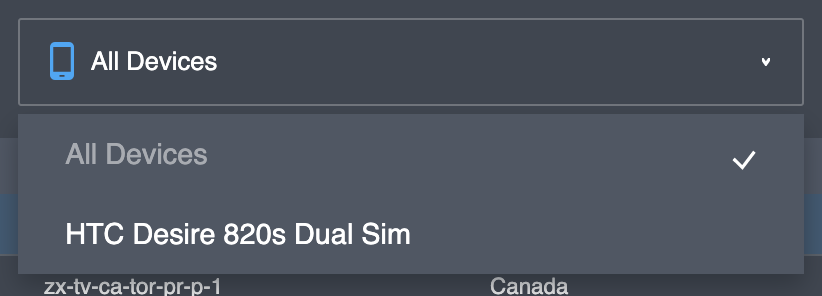

# User page

## General data

General user data includes the following information:

<table>
  <thead>
    <tr>
      <th style="text-align:left">Parameter</th>
      <th style="text-align:left">Description</th>
    </tr>
  </thead>
  <tbody>
    <tr>
      <td style="text-align:left">Traffic</td>
      <td style="text-align:left">User daily bandwidth limit (in Mb). If the user doesn&apos;t have a bandwidth
        limit, you will see <em>&apos;Unlimited&apos;</em>. You can change the user
        bandwidth limit (see below).</td>
    </tr>
    <tr>
      <td style="text-align:left">License</td>
      <td style="text-align:left">User license. The license determines how many devices a user can register.
        You can change the license (see below).</td>
    </tr>
    <tr>
      <td style="text-align:left">Activated devices</td>
      <td style="text-align:left">Number of user&apos;s registered devices</td>
    </tr>
    <tr>
      <td style="text-align:left">Status</td>
      <td style="text-align:left">
        
User status:

        <ul>
          <li>Invited - a user that has been registered, but has not logged in for the
            first time.</li>
          <li>Active - an active user.</li>
          <li>Disabled - a blocked user. The user can&apos;t use the Platform services.</li>
        </ul>
      </td>
    </tr>
    <tr>
      <td style="text-align:left">Registration time</td>
      <td style="text-align:left">The time of the first user&apos;s registration in the project.</td>
    </tr>
    <tr>
      <td style="text-align:left">Purchases</td>
      <td style="text-align:left">This parameter is displayed only for users of <em>&apos;Public VPN&apos;</em> projects.
        If a user has an active subscription, this field will contain <em>&apos;Active&apos;</em>.</td>
    </tr>
    <tr>
      <td style="text-align:left">Extref</td>
      <td style="text-align:left">Additional parameter. It can include any data (e.g. User ID of your external
        service). You can change this (see below).</td>
    </tr>
    <tr>
      <td style="text-align:left">Description</td>
      <td style="text-align:left">User description (e.g. user&apos;s full name). You can change this (see
        below).</td>
    </tr>
    <tr>
      <td style="text-align:left">User country</td>
      <td style="text-align:left">User&apos;s original country. You can change this (see below).</td>
    </tr>
    <tr>
      <td style="text-align:left">Auth method</td>
      <td style="text-align:left">Authentication method of this user.</td>
    </tr>
  </tbody>
</table>

## Sessions

All sessions of the user you can found in this page. This page include the list of sessions and the search filter.

| Parameter | Description |
| :--- | :--- |
| Device ID | Device ID, generated by Platform. |
| Server | Name of VPN node. VPN session active between the user device and this server. |
| Location | Location of the VPN server. |
| Start time | Session start time. |
| End time | Session end time. If the session is active, this field will be empty. |
| Internal IP | Internal IP address this session \(VPN node assigns the IP for this session\). This IP is not a real user's IP or user external IP. |
| Download | Receive bites |
| Upload | Transmit bites |

You can sort the list data by any column.


Active sessions you will see on top the session list.


In the top, there is the filter option. You can filter the session list by user device or session time.


Filter time period for sessions can be up to 30 days.


## Devices

All user devices you can found in this page. This page include the list of devices.

<table>
  <thead>
    <tr>
      <th style="text-align:left">Parameter</th>
      <th style="text-align:left">Description</th>
    </tr>
  </thead>
  <tbody>
    <tr>
      <td style="text-align:left">Device ID</td>
      <td style="text-align:left">Device ID, generated by Platform.</td>
    </tr>
    <tr>
      <td style="text-align:left">Access Token</td>
      <td style="text-align:left">Device secret, generated by Platform.</td>
    </tr>
    <tr>
      <td style="text-align:left">Name</td>
      <td style="text-align:left">Device name</td>
    </tr>
    <tr>
      <td style="text-align:left">Device Type</td>
      <td style="text-align:left">
        
Device type:

        <ul>
          <li>Android</li>
          <li>iOS</li>
          <li>macOS</li>
          <li>Windows</li>
        </ul>
      </td>
    </tr>
    <tr>
      <td style="text-align:left">Registration Time</td>
      <td style="text-align:left">Device registration time</td>
    </tr>
  </tbody>
</table>

You can delete a user device  \(see actions on this page\).

## Purchases

All user subscription you can found in this page. This page include the list of subscriptions.


This page available only in "_Public VPN_" projects.


<table>
  <thead>
    <tr>
      <th style="text-align:left">Parameter</th>
      <th style="text-align:left">Description</th>
    </tr>
  </thead>
  <tbody>
    <tr>
      <td style="text-align:left">Transaction ID</td>
      <td style="text-align:left">Purchase transaction ID</td>
    </tr>
    <tr>
      <td style="text-align:left">Product ID</td>
      <td style="text-align:left">Purchase product ID</td>
    </tr>
    <tr>
      <td style="text-align:left">Type</td>
      <td style="text-align:left">
        
Purchase type:

        <ul>
          <li>apple</li>
          <li>google</li>
          <li>...</li>
        </ul>
      </td>
    </tr>
    <tr>
      <td style="text-align:left">Transaction Time</td>
      <td style="text-align:left">Purchase transaction time</td>
    </tr>
    <tr>
      <td style="text-align:left">Expiration Time</td>
      <td style="text-align:left">Purchase expiration time</td>
    </tr>
    <tr>
      <td style="text-align:left">Active</td>
      <td style="text-align:left">Active purchase or not</td>
    </tr>
    <tr>
      <td style="text-align:left">Trial</td>
      <td style="text-align:left">Trial period active or not</td>
    </tr>
    <tr>
      <td style="text-align:left">Raw Data</td>
      <td style="text-align:left">Raw purchase data in JSON format</td>
    </tr>
  </tbody>
</table>

You can deactivate active purchase and try to activate no-active purchase \(see actions on this page\).

## Actions

### Change the user bandwidth limit

For change parameters "_Traffic_" you need to 

1. Open User _General_ tab 
2. Click to  edit icon near the field.

3. In this form you can 

* set any daily limit \(bites\),
* set checkbox "_Traffic reset_". Actual daily limit will reset to 0 after the limit update.
* set the user unlimited.

  4. Click the "_Set limit_" button for update.

### Change the license

For change parameters "_License_" you need to 

1. Open User _General_ tab 
2. Click to  edit icon near the field.
3. Select new license from list of available licenses and click the "_Save_" button for update.


The license name usually includes 2 numbers. The first number is the limit of devices.


### Change Description&Extref&Country

For change parameters "_Description_", "_Extref_" or "_User country_" you need to 

1. Open User _General_ tab 
2. Click to  edit icon near the field.
3. Change the field and click the "_Save_" button for update.

### Change user status

For activate or deactivate user you need to 

1. Open User _General_ tab 
2. Click to  checkbox of the "Status". Checkbox ON - User active, checkbox OFF - user disabled.

### Delete device

If a user doesn't have free devices slots \(reach the limit of devices\), you can delete his old registered devices. 


Sessions with deleted devices will available in user sessions story.


For delete user device you need to 

1. Open User _Devices_ tab 
2. Select device to delete and click icon .

   3. Click the "_Delete device_" button to finish.

### Activate/deactivate purchase

You can try to activate a purchase or deactivate the active purchase. 

#### Deactivate purchase

For deactivate a purchase you need to 

1. Open User _Purchases_ tab 
2. Select active purchase in the purchases list and click to  icon in the right side this line. 

   3. Click the "_Disable purchase_" button for deactivation.


Usually, application logic tries to recover purchase if they have a valid purchase receipt.


#### Activate purchase

For activate a purchase you need to 

1. Open User _Purchases_ tab 
2. Select inactive purchase in the purchases list and click to  icon in the right side this line. 

   3. Click the "_Activate purchase_" button for activation.


The Platform verifies active purchases every 24 hours. If this purchase verification will fail, the platform automatically deactivates this purchase again.


### Delete user

You can delete user and all user data \(user info, user devices, session story\). For delete user you need to

1. Click the icon on top right cornel.

   2. Set the user ID. This need for additional verification of your action. 

   3. Click the "_Delete user data_" button to finish.


This action is irreversible.


