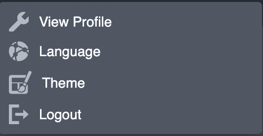
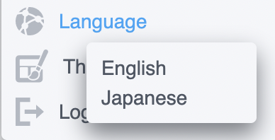
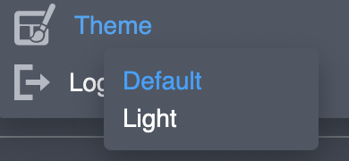

# Change console settings

Current version of the Management Console supports switching between interface languages and visual themes. Either option can be chosen by clicking on the owner account name in the upper-right corner:

In order to change the interface language click on the respective "**Language**" menu item. Confirm your preference by clicking on the sub-menu item:

To switch between visual themes, click on the respective "**Theme**" menu item and confirm your choice by clicking on the sub-menu item:

