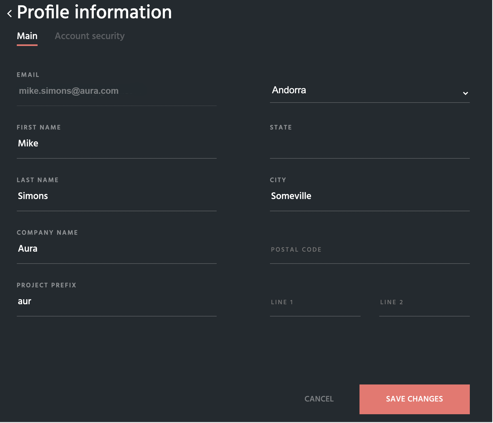
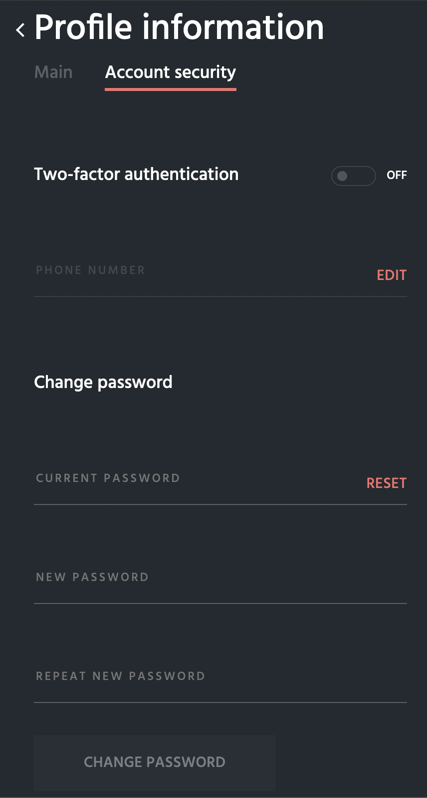

# Edit your profile

The profile information can be changed by clicking on the owner account name in the upper-right corner and choosing the "**Profile**" menu item:


You can edit any information except for **email**


The separate tab "**Account security**" allows to change a password for your current account:


It is highly recommended that you turn on the **two-factor authentication** mechanism


