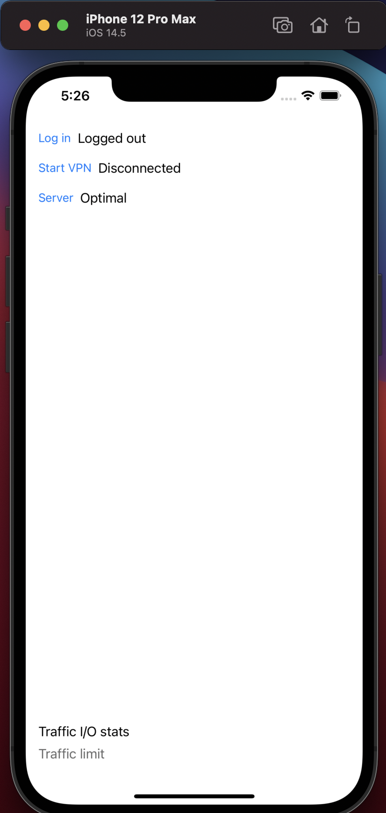
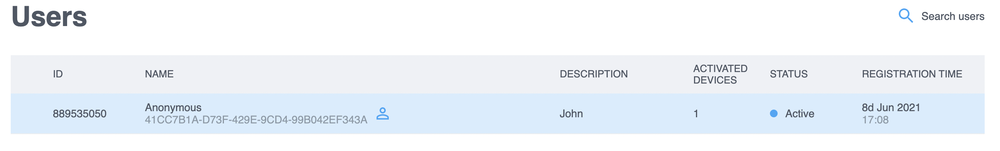
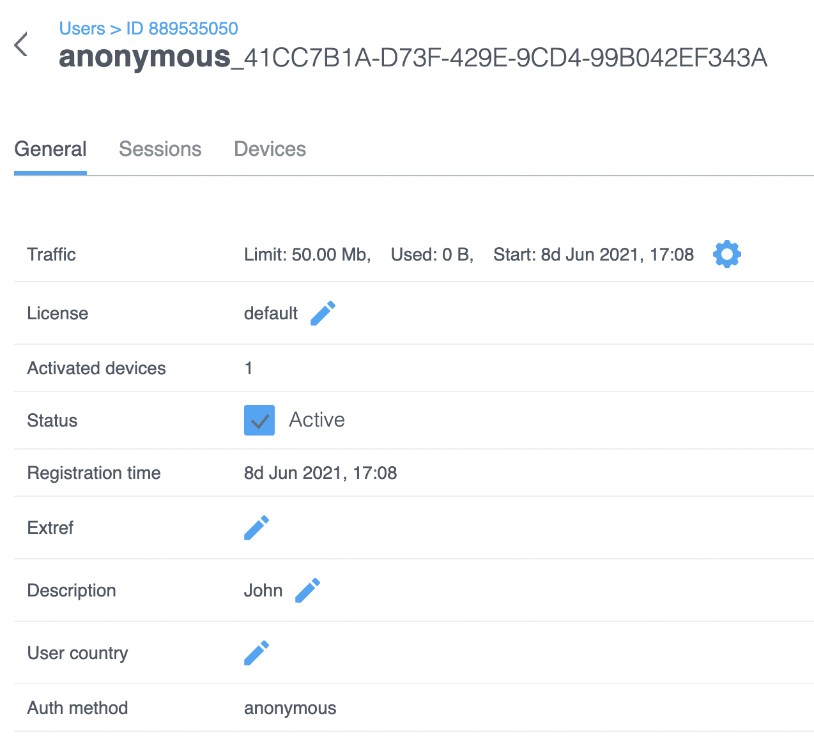
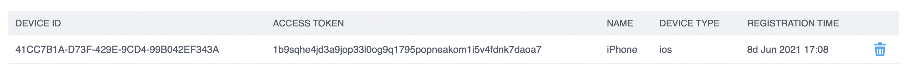

# Try out the demo app

## General

You can get the latest demo Xcode project from the repository:




Instructions from the README file can be omitted, since they have already been implemented in the latest version of the project


After you open the project in the Xcode, locate the _AppDelegate.swift_ file and fill the "**carrierId**" variable with the value of **ProjectID** for your project:

```text
CakeTube.instance().configure(CTConfig.create { (c) in
            c.baseUrl = "https://backend.northghost.com"
            c.carrierId = ""
            c.vpnProtocol = .ikEv2
            c.vpnProfileName = "CakeTubeSDK App"
        })
```

You can find the **ProjectID** value in the upper right corner of the Management Console, below the project name



ProjectID is set on the project creation form and cannot be changed after that


Build the project and run it in the simulator. The running application should look like this:




Be aware that simulation of iOS device does not support opening of the VPN sessions and is limited to log in function


Try to log in by clicking the respective button and take a look on the **Users** page of the Management Console:








## Possible issues

> Building for iOS Simulator, but the linked and embedded framework was build for iOS + iOS Simulator


>


If you are building the project on the M1 Apple Silicon, you can also get another error:

> Building for iOS Simulator, but linking in dylib built for iOS

In order to fix it, you will need to add "**arm64"** into the "**Excluded Architecture**" of target's **Build settings**


It would probably be missing in the list, you need to type it in



