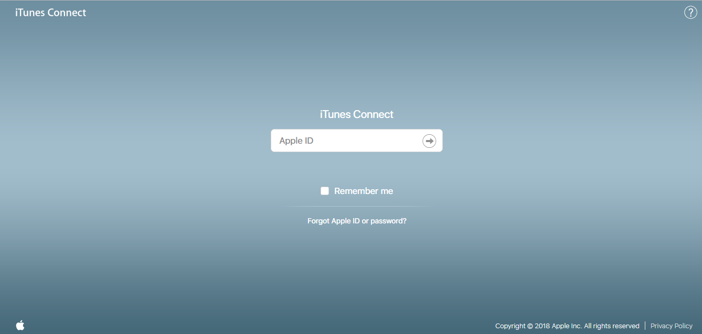
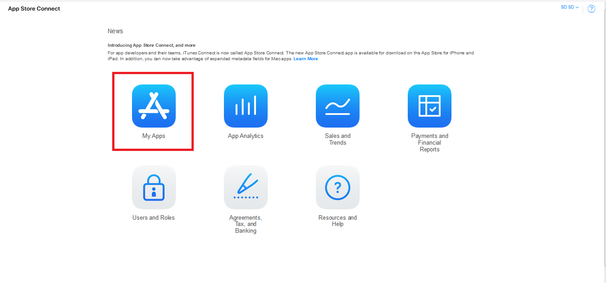
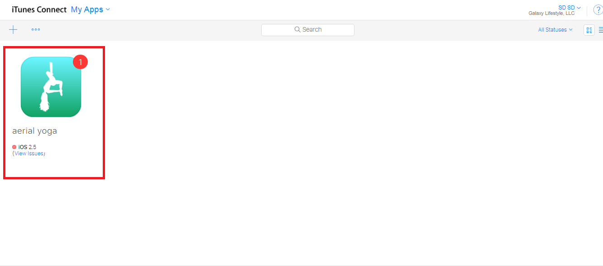
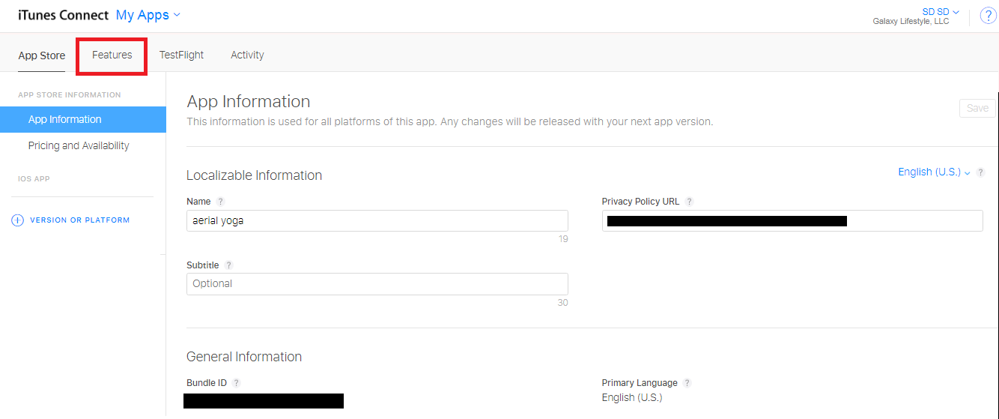
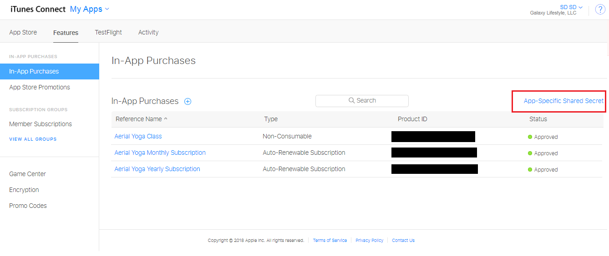
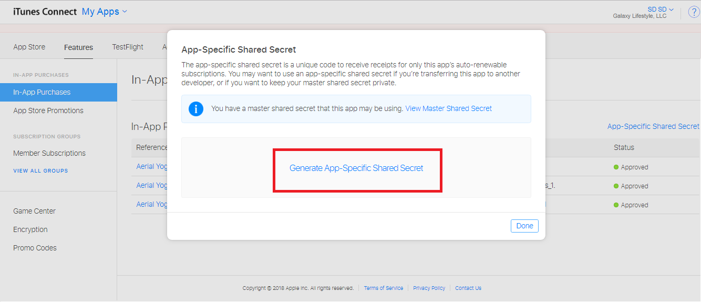
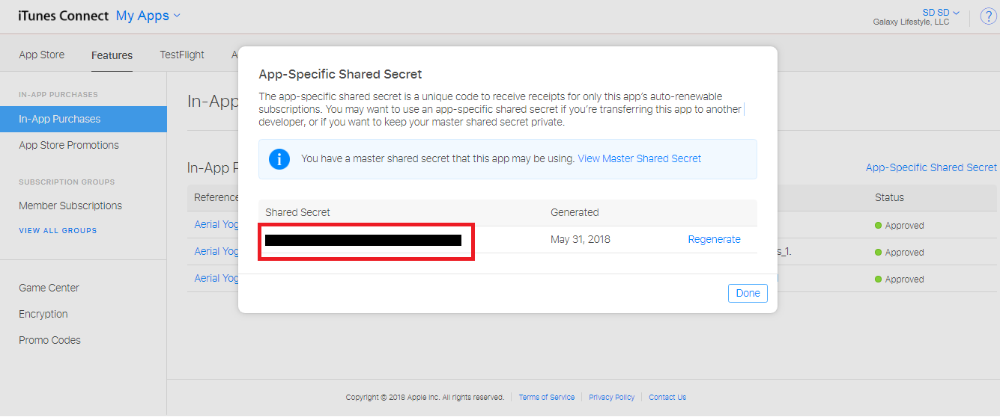

# How can I get Shared Secret key from iTunes Connect for In-App Purchase

Users download and install applications from different app stores. Apple helps users keep a secret key in a keychain as an excellent way to secure their regular and secret apple apps.

Secret key has been designed for the users to make it easy for them to control their auto-renewal in-app purchases for various [apps](https://www.appypie.com/how-to-create-an-app) they have installed in their smartphones.

## Follow below mentioned steps to easily obtain Shared Secret key from iTunes Connect for In-App Purchase:

 **Step 1:** Login into your iTunes Connect Development account  

 **Step 2:** Click on My Apps icon  

 **Step 3:** All of your created applications will appear. Click on the specific app for which you want to enable In-App Purchase  

 **Step 4:** Go to **Features**  

 **Step 5:** Click on **App Specific Shared Secret**  

 **Step 6:** A pop-up window will appear, click on **Generate App-Specific Shared Secret**  

 **Step 7:** Here is your Shared Secret Key, copy and paste it into the respective field on creator software  

## **What is the Secret Key?**

A secret key is an information or parameter, which is used to decrypt and encrypt messages in encryption, secret key, or symmetric. Two separate keys are used in this encryption process - Public key and Secret key.

## **What is the Shared Secret Key?**

A shared secret key is a cryptographic data or key, only shared with the parties engaged in the secured communication. The key can be anything from passphrases or passwords, to an array of randomly chosen data or a random number.

Without using a shared secret key in any specific communication, the parties involved can’t guarantee each other’s identity.

The Shared Secret Key can be used to authenticate the instances while logging into a remote system through techniques such as challenge-response or it can also be used for a key derivation function to create one or more keys to be used for encryption.

## **Shared Key Authentication \(SKA\)**

Shared Key Authentication is a procedure by which a computer can get access to a specific wireless network area that follows the Wired Equivalent Privacy protocol. The access point of the shared secret key responds by generating a series of characters called a ‘challenge text’ for the computer.

Further, the computer encodes the challenge text with its Wired Equivalent Privacy key and conveys the ‘message’ in return to the access point. The access point decodes the ‘message’ and relates the result with the initial challenge text. If there are no differences, the access point directs the authentication code to the associating computer.

Lastly, the computer receives the authentication code and turns out to be a part of the network for the directed time of the session or for as long as it stays within the range of the initial access point. In case, the decoded ‘message’ does not specifically agree with the initial text, the access point does not permit the computer to be a part of the network.

A wireless-outfitted computer can link to a Wired Equivalent Privacy network access point without shared secret keys using a method known as Open System Authentication, but this process does not allow the computer to accept encrypted data.

## **iTunes Connect**

iTunes Connect is a service platform developed by Apple Inc., which allocates digital content providers to manage and upload content such as e-books, movies, music, etc. circulated through Apple's online stores: iBook and iTunes Store.

Previously, iTunes Connect also used to manage and upload applications on Mac App Store and the App Store, but in June 2018, Apple launched App Store Connect as an individual, however, visually similar, service.

Both App Store Connect and iTunes Connect let users edit, add, remove, edit digital items’ metadata \(keywords, screenshots, description\), manage availability, view analytics \(revenues, number of downloads, and more\), and collaborate on the similar tasks by increasing the number of team members.

## **Shared Secret Key for iTunes Connect**

The secret key is part of a pair of keys, that remains available to one person or the authorized participants evolved in a specific communication. The secret key is used to open the lock, in this case, to 'unlock' apps.

Apple introduced iTunes Connect to help the users make changes to their applications. It has allowed users to secure their applications by applying a secret key to them. It provides a unique secret key to keep the normal and secret apple apps secure.

Users can also apply this unique key on in-app purchases to deal with regular and secret apple app’s auto-renewal subscriptions. This key allows users to verify in-app purchases.

Apple provides developers the way to include auto-renewing subscriptions in regular and secret apple apps, but not the set of tools that many users would consider necessary to efficiently control those subscriptions.

An auto-renewable subscription service is an iOS In-App Purchase category that permits an app to charge for features or content over a fixed amount of time.

## **Conclusion**

Among millions of applications available for the installation in Apple App Stores, not all of them have in-app purchases or subscription charges. But some useful apps need to be secured and controlled in terms of auto-renewable subscriptions.

Users have been provided with the shared secret key to get the same job done. These apps include the regular apps that you keep handy and the secret apple apps that you need to keep locked.

