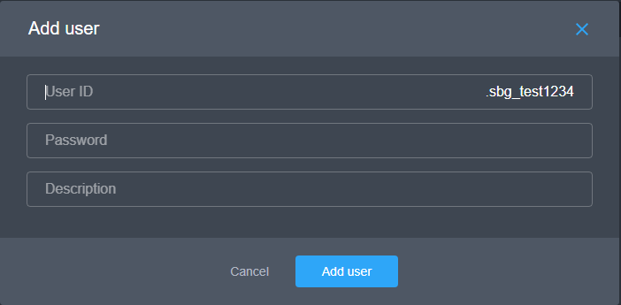

# Creating a Business VPN Project

## Creating a Business VPN Project

1. You need to sign up to the management console. Required steps are described on the ['Sign Up to Developer console' page](https://app.gitbook.com/@pango/s/pango-platform/~/drafts/-M7Nmxtwc21AtQC8MweG/start-exploring/sign-up-to-dev-console).

2. Now, it is time to create the first project following the steps described on the ['Create the new Project' page](https://app.gitbook.com/@pango/s/pango-platform/~/drafts/-M7Nmxtwc21AtQC8MweG/start-exploring/add-a-new-project).


In the creation form, choose 'Private VPN' in a drop-down list titled 'Project type' and choose a preferred authorisation type, 'Email' or 'User ID'.

If you want users to log in to the project using their email and a password, choose 'Email'. If you want them to log in using certain user IDs and a password, choose 'User ID'.


3. To add a user to the project, choose 'Users' in the left menu and click 'Add' in the top-right corner, then choose 'Add user'. 



If you have chosen Email as the authorisation type, then when adding new users to the project, enter their email address to grant them access to the VPN. They will have to use this email and a provided password to access the VPN via the Wifi Security for Business app. If you don't fill the 'Password' field, the user will receive an email with a link that allows them to set their desired password.


You can enter any information about the user in the 'Description' field; nobody except project members \(not users!\) will be able to see it.




If you have chosen User ID as the authorisation type, then when adding new users to the project,  enter their ID to grant them access to the VPN. They will have to use this ID and a provided password to access the VPN via the Wifi Security for Business app. In this case, the 'Password' field is mandatory.


You can enter any information about the user in the 'Description' field; nobody except project members \(not users!\) will be able to see it.




