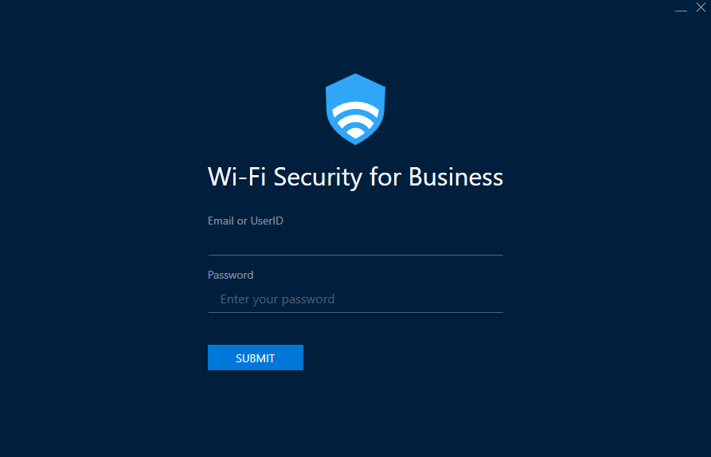
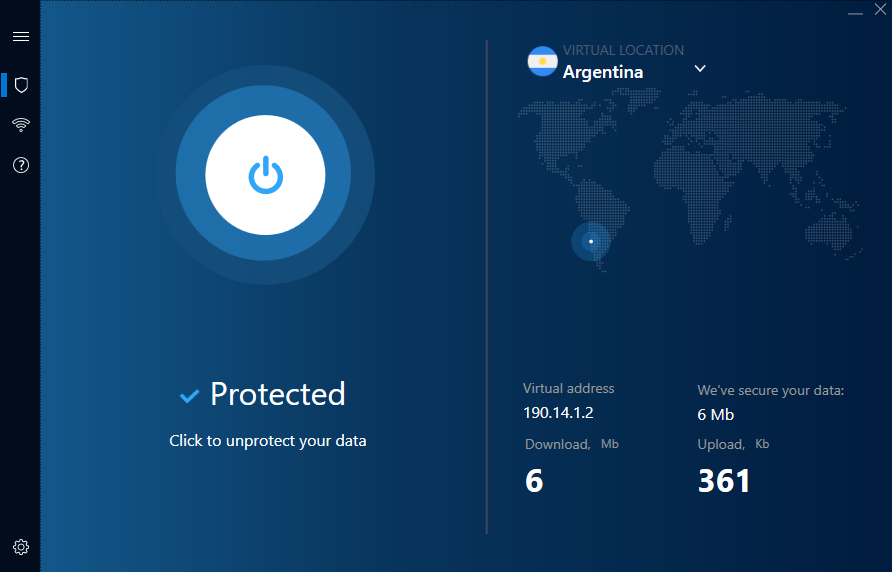
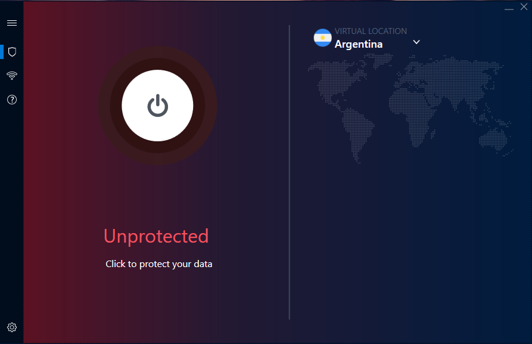
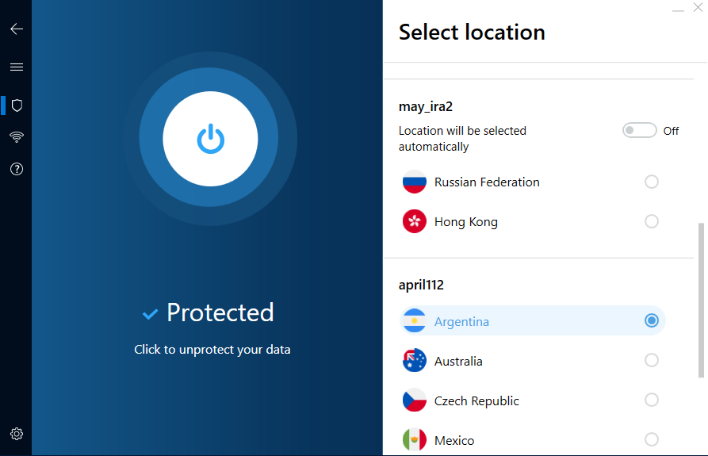
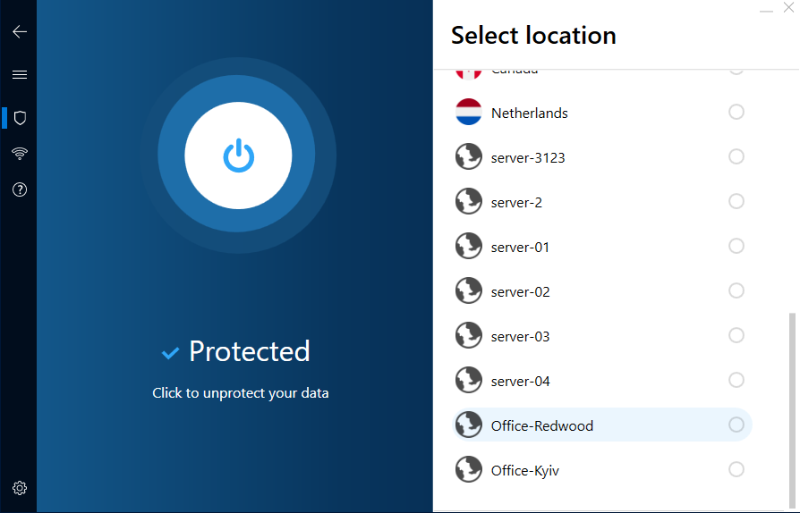
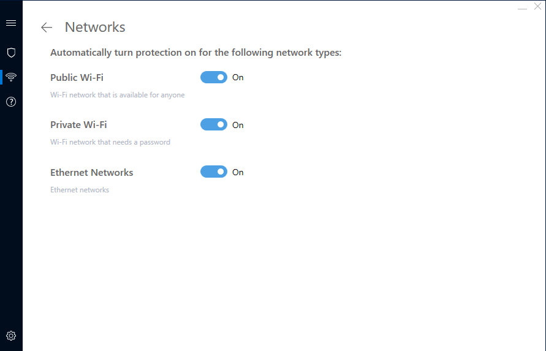
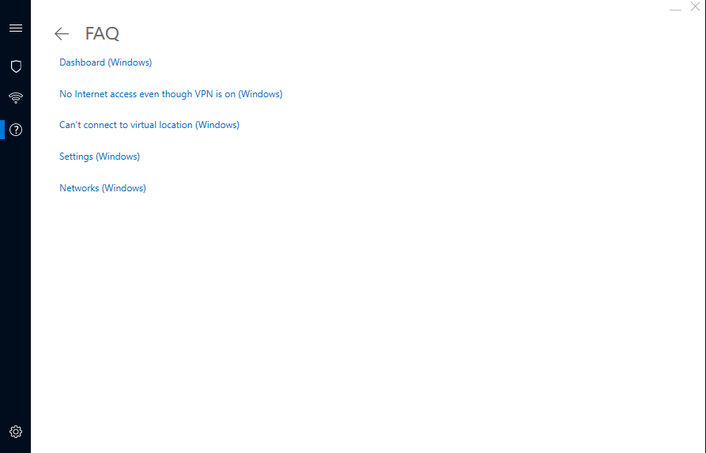
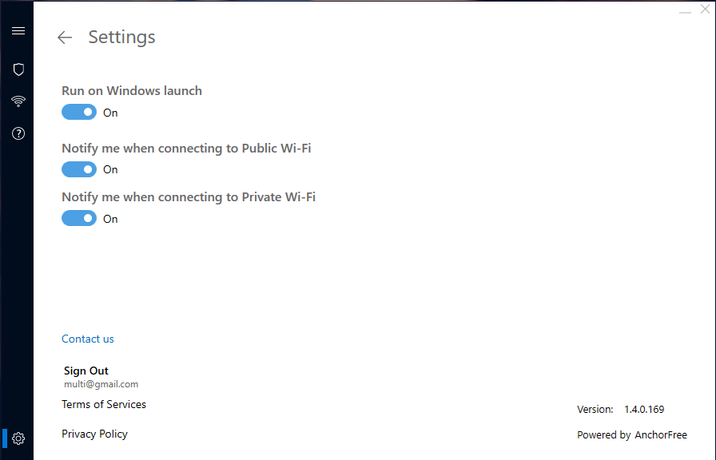

# Wi-Fi Security for Business

'Wi-Fi Security for Business' is a versatile application designed for the needs of clients who want to provide VPN to a specific number of users. All the users have to do is log in using either their emails or user IDs, depending on the authorisation type in your specific project. If a user was added to your project, they will be able to access it through this application and connect to any of the available virtual locations.

To download the 'Wi-Fi Security for Business' application for different platforms, follow the corresponding links:

[Windows](https://firebasestorage.googleapis.com/v0/b/oauth-default-4d635.appspot.com/o/Windows%2FWi-Fi_Security_for_Business_1.3.2.127.msi?alt=media&token=b9dabb98-0031-4fba-a728-372b5322877a)

[Android](https://play.google.com/store/apps/details?id=com.anchorfree.wifisecuritybusiness&hl=en_US)

[iOS](https://apps.apple.com/us/app/wi-fi-security-for-business/id1441048544)

macOS - the app is not available for general public, but you can acquire it if you contact us

Below, we will explore user interface of the Windows application, but it is quite similar to the applications on other platforms, so it is a decent representation of all the 'Wi-Fi Security for Business' applications we offer. 

The first thing you see after installing and launching the 'Wi-Fi Security for Business' application is a log-in screen:

There, you \(or a user you have added to the project\) have to enter credentials to access the project. 


Please note that even if you are the owner of the project, you have to add a user for yourself to access the vpn.


After a successful authentication, you will be directed to the main screen of the application and connected to the most suitable vpn server \(diplayed in the top-right portion of the screen\):











On this screen, you can:

* Choose a server in a 'Virtual location' drop-down menu on the right
* Stop sending your data through a vpn tunnel by pressing the big 'Connect' button on the left
* Check your virtual address, how much data has been uploaded and downloaded through vpn and how much data has been secured

If you are added to multiple projects as a user, you will be able to choose between available virtual locations arranged by project.

Also, if there are private servers added to the project, you will be able to see them in the list.

By clicking on the burger menu in the top-left corner, you can expand the menu on the left, revealing the names of the menu items:

  Or, you can just click the items right away to jump to corresponding pages.

If you set the 'Public Wi-Fi' slider to 'Off', next time you connect to a public wi-fi network \(e.g. a network in a library or a mall\), the application will not automatically send your data through a secure channel.  
The same goes for private wi-fi networks \(e.g. at home or at work\) and ethernet networks \(connection through a cable\).

On the 'Networks' page you can change how the application acts when connected to public, private and ethernet networks.

If you encounter any sort of trouble while using the application, consult the FAQ page. It contains the troubleshooting tips for the most frequent problems.

On the 'Settings' page, you can change global setting of the application, as well as contact us, sign out of the account and view both terms of service and privacy policy. The version of the application is also situated on this page.

