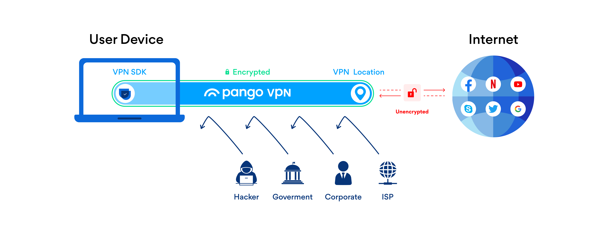

# Public VPN

VPN stands for Virtual Private Network. A VPN connects your device to the Internet through another computer. You’re connecting to the Internet through another computer’s Internet connection, rather than directly through your own. Aside from that, the VPN also encrypts the data you send, so that it’s kept secure.

A simple analogy would be sending a postcard with and without an envelope (via VPN and without it, respectively). If you send your postcard without an envelope, somebody (an Internet Service Provider or even a hacker) can easily read its contents. On the other hand, if you use an envelope, the postcards contents will remain much harder to read, thus preserving your privacy. It is as simple as that!

VPN protocols determine exactly how data is routed through a connection. These protocols have different specifications based on the benefits and desired circumstances; for example, some VPN protocols prioritize data throughput speed while others focus on masking or [encrypting](https://www.netmotionsoftware.com/blog/security/data-encryption-101/) data packets for privacy and security. We offer SDKs using 3 different VPN protocols: IPSEC, OpenVPN and proprietary Hydra protocol.

* IPSEC/L2TP: Layer 2 Tunnel Protocol is a replacement of the PPTP VPN protocol. This protocol does not provide any encryption or privacy out-of-the-box and is frequently paired with security protocol IPSEC. Once implemented, L2TP/IPSEC is extremely secure and has no known vulnerabilities.\
  Keywords: widely used, good speeds, easily blocked due to reliance of UDP on single port.
* OpenVPN: OpenVPN is an open source protocol that allows developers access to its underlying code. This protocol has grown in popularity due to its use of (virtually unbreakable) AES-256 bit key encryption with 2048-bit RSA authentication and a 160-bit SHA1 hash algorithm.\
  Keywords: open source, strongest encryption, slower speeds.
* Hydra: to learn about this protocol, please refer to the [FAQ](https://support.hotspotshield.com/hc/en-us/articles/360000374343-What-s-the-protocol-used-by-Hotspot-Shield-).

Public VPN is the product we developed so you can let anyone use fast, secure and safe VPN with access to 30+ locations with 1000+ servers. You can either use a sample designed/developed application or build your own app from scratch using provided SDKs and publish it on a corresponding platform. A user just presses 'Connect' and receives all the benefits of a secure network. The application creates a VPN tunnel that connects the user to the Internet.

The main features of Public VPN are:

* Security. All the traffic from your computer to the node is encrypted, even if you are using a public network, so a potential hacker is much less likely to intercept it. Also, the government, corporations and your Internet Service Provider (ISP) cannot collect and process your traffic, making your browsing history more private (see figure above);
* Anonimity. Your real IP address is concealed, so it allows you to maintain your online privacy and search the web anonymously. Whatever node you choose, thousands of people are using it day and night, thus it is much harder for other people to access your search history;
* Content unblocking. By connecting to a server in a different country, you can change your geographical location. Access any website in countries that have restricted connection to those sites.&#x20;

To create an application for users, we provide SDKs for different platforms and with different VPN protocols:&#x20;

* [VPN SDK for Android](https://pango.gitbook.io/pango-platform/sdk/untitled)  (supports Hydra and OpenVPN protocols)
* [Hydra VPN SDK for iOS/macOS](https://pango.gitbook.io/pango-platform/sdk/hydra-vpn-sdk-for-ios) &#x20;
* [IPSEC VPN SDK for iOS/macOS](https://pango.gitbook.io/pango-platform/sdk/ipsec-vpn-sdk-for-ios-macos) &#x20;
* [Hydra SDK for Windows](https://pango.gitbook.io/pango-platform/sdk/hydra-sdk-for-windows) &#x20;
* [HydraVPN SDK for Routers](https://pango.gitbook.io/pango-platform/sdk/hydravpn-sdk-for-routers)

If you are looking for a sample application, you do not have to go elsewhere, we got them right here:

* [Hydra VPN SDK demo for iOS](https://pango.gitbook.io/pango-platform/demo-applications/untitled) &#x20;
* [IPSEC VPN SDK demo for iOS](https://pango.gitbook.io/pango-platform/demo-applications/ipsec-vpn-sdk-demo-for-ios) &#x20;
* [Hydra VPN SDK demo for Android](https://pango.gitbook.io/pango-platform/demo-applications/anchorfree-hydra-vpn-sdk-demo-for-android) &#x20;
* [Hydra VPN SDK demo for Windows](https://pango.gitbook.io/pango-platform/demo-applications/hydra-vpn-sdk-demo-for-windows) &#x20;
* [OpenVPN SDK for Windows](https://pango.gitbook.io/pango-platform/demo-applications/openvpn-sdk-for-windows) &#x20;

When using a sample application, you just have to set a server to connect to and you are good to go.
