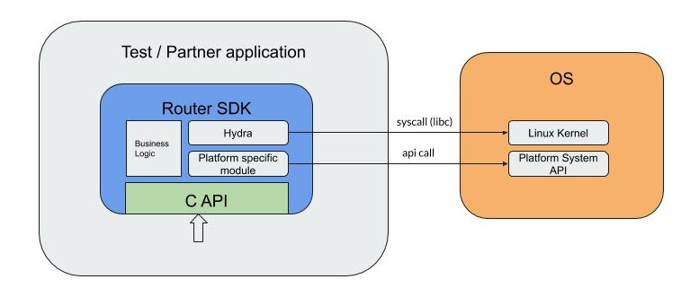
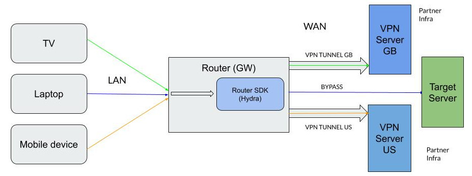

# Hydra VPN SDK for Routers

## Overview

Router SDK is a part of Pango Platform which contains client-side libraries and server-side applications needed to implement custom VPN infrastructure.

## Core features

Router SDK can intercept traffic for individual devices \(src IP based routing\) and route it to a specific VPN server \(multi-server, multi-country\). SDK notifies the Application about important events using a callback mechanism.

Router SDK provides a [shared library](hydra-vpn-sdk-for-routers-sdk.md) \(with C header file\) which can be integrated with Application using C calls. Ready-to-go [VPN client application](hydra-vpn-sdk-for-routers-ci/) with multiple configuration interfaces is also available.

