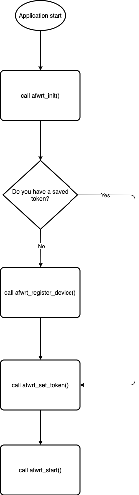

# SDK. Shared library.

Router SDK provides a shared library \(with a C header file\) that can be integrated with Applications using C calls.

## SDK C API

```text
int afwrt_init(const char *params_json, void (event_callback)(const char *event_str));
```

Initialize library. Must be called once before using the library. 

`params_json` - configuration in JSON format. See the ["Configuration"](hydra-vpn-sdk-for-routers-sdk.md#configuration) section below. Can't be NULL. 

`event_callback` - callback function to receive periodic SDK events. See the ["Callback events" ](hydra-vpn-sdk-for-routers-sdk.md#callback-events)section below. Can be NULL.

```text
int afwrt_deinit(void); 
```

Deinitialize library. Must be called once after using the library.

```text
int afwrt_start(void);
```

Start library main loop. Blocking call.

```text
int afwrt_stop(void);
```

Stop library event loop.

```text
char* afwrt_get_locations(void);
```

Returns the same JSON response as [/user/locations](https://anchorfreepartner.github.io/apidocs/user.html#get-/user/locations). 


User is responsible for `free()`ing the string.


```text
int afwrt_protect_ip_addr(const char *ip_addr, const char *country);
```

Add a rule to route traffic from a specified IP address via a specified VPN country. Returns 0 on success, -1 on error. Safe to call multiple times to change the country.

`ip_addr` - IP address to protect

`country` - VPN country to route traffic to

```text
int afwrt_unprotect_ip_addr(const char *ip_addr);
```

Remove rule to route traffic from specified IP address via VPN. Returns 0 on success, -1 on error.

`ip_addr` - IP address to unprotect

```text
int afwrt_protect_mac_addr(const char *mac_addr, const char *country);
```

Add a rule to route traffic from a specified MAC address via a specified VPN country. Returns 0 on success, -1 on error. Safe to call multiple times to change the country.

`mac_addr` - MAC address to protect

`country` - VPN country to route traffic to

```text
int afwrt_unprotect_mac_addr(const char *mac_addr);
```

Remove rule to route traffic from specified MAC address via VPN. Returns 0 on success, -1 on error.

`mac_addr` - MAC address to unprotect

```text
int afwrt_protect_iface(const char *iface, const char *country);
```

Add a rule to route traffic from a specified interface via a specified VPN country. Returns 0 on success, -1 on error. Safe to call multiple times to change the country.

`iface` - interface to protect

`country` - VPN country to route traffic to

```text
int afwrt_unprotect_iface(const char *iface);
```

Remove rule to route traffic from specified interface via VPN. Returns 0 on success, -1 on error.

`iface` - interface to unprotect

```text
const char *afwrt_register_device(const char *auth_method, 
                                  const char *auth_token);
```

Register a new device and returns an access token, that will also be included in the configuration. Saving a received token value would be considered a good practice. 

`auth_method` - any supported OAuth provider \(i.e. Firebase\) or anonymous

`auth_token` - OAuth token \(if a relevant OAuth provider is set for the auth method\)

```text
int afwrt_set_access_token(const char *access_token)
```

Add access token value to the current configuration

`access_token` - platform API access token, received from `afwrt_register_device` method

## Typical workflow

You should implement your own OAuth token obtaining mechanism and use it before `afwrt_register_device` call.



## Callback events

```text
"route_connected"
```

This event is sent when a link to one of the virtual locations became active. 

_Example:_ `{ "event": "route_connected", "route_name": "us" }`

```text
"route_disconnected"
```

This event is sent when an active link to one of the virtual locations became inactive due to SDK stop, network condition, or for another external reason. 

_Example:_ `{ "event": "route_disconnected", "route_name": "us" }`

```text
"route_failed"
```

This event is sent when a link to one of the virtual locations can not be established. 

_Example:_ `{ "event": "route_failed", "route_name": "fr", "reason_details": "connection failed" }`

```text
"bandwidth_info"
```

An event is sent periodically to the client application. 

_Example:_ `{ "event": "bandwidth_info", "bandwidth_info": [ { "data_interval_ms": 100, "n_points": 100, "points_downstream": 0, "points_upstream": 0, "route_name": "us" }, { "data_interval_ms": 100, "n_points": 100, "points_downstream": 0, "points_upstream": 0, "route_name": "de" } ] }`

## Configuration

### Minimal working configuration

```text
{
    "tun_ifname" : "wrt0",
    "wan_ifname" : "eth1"
}
```

### All configuration parameters

```text
"tun_ifname"
```

Name of virtual TUN interface created by SDK. 

_Example:_ `"wrt0"`

```text
"wan_ifname"
```

Name of virtual TUN interface created by SDK. 

_Example:_ `"eth1"`

```text
"vl_default"
```

Default virtual location, country code. By default, all traffic routed to the SDK TUN interface goes through this location. If not specified or empty, SDK will try to get an optimal location that can be configured on the backend side. 

_Default:_ `""`\(empty, see above\)

_Example:_ `"us"`

```text
"backend"
```

Backend server address. 

_Default:_ `"https://default-backend.net"`

```text
"data_report_interval"
```

Event report interval in milliseconds. The time interval between bandwidth events \(see ["Callback events"](hydra-vpn-sdk-for-routers-sdk.md#callback-events) section above\). 

_Default:_ `30000` \(30 seconds\)

```text
"default_gateway"
```

Redirect all traffic including router to SDK TUN interface. Do not create any specific iptables rule for protected IP, MAC, or interface\(see ["Routing"](hydra-vpn-sdk-for-routers-sdk.md#routing) section below\), but add a global traffic redirection rule. 

_Default:_ `0`

```text
"config_dir"
```

Location of VPN core temporary files. SDK creates or updates a set of temporary files on each start. A directory should be already created for them.

_Default:_ `"/etc/afwrt"`

```text
"tun_dev_path"
```

Path to OS tun device. 

_Default:_ `"/dev/net/tun"`

```text
"tun_addr"
```

IPv4 address of SDK TUN interface. 

_Default:_ `"100.73.0.73"`

```text
"protected_ip_addrs"
```

Array of protected IP addresses with not empty `"ip_addr"` and `"vl"` fields. 

_Default:_ `""`\(empty, no IP addresses to protect\). 

_Example:_ `"protected_ip_addrs": [ { "ip_addr": "192.168.50.159", "vl": "us-new-york" }, { "ip_addr": "192.168.50.139", "vl": "de-berlin" } ]`

```text
"protected_mac_addrs"
```

 An array of protected MAC addresses with no empty `"mac_addr"` and `"vl"` fields. 

_Default:_ `""`\(empty, no MAC addresses to protect\). 

_Example:_ `"protected_mac_addrs": [ { "mac_addr": "08:00:27:AA:D7:17", "vl": "us-new-york" }, { "mac_addr": "09:01:28:AB:D8:18", "vl": "de-berlin" } ]`

```text
"protected_ifaces"
```

An array of interfaces with not empty `"iface"`and `"vl"` fields. 

_Default:_ `""`\(empty, no interface to protect\). 

_Example:_ `"protected_ifaces": [ { "iface": "eth1", "vl": "us-new-york" }, { "iface": "br0", "vl": "de-berlin" } ]`

## OS level routing

To protect traffic, SDK creates a TUN device and routes all packets or packets with specific source IP, MAC, or interface to it. To achieve this, SDK creates a set of routing and/or firewall \(iptables\) rules.

### Simple scenario. `"default_gateway"` option enabled.

Redirect just all traffic including router to TUN device. 

To be smarter, SDK not changing the default route of the router "main" table, but adding two big subnets with high metrics. `0.0.0.0/1` and `128.0.0.0/1` for IPv4, for example.

```text
# ip route show table main
0.0.0.0/1 dev wrt0 scope link  metric 1000 
128.0.0.0/1 dev wrt0 scope link  metric 1000 
```

### Advanced scenario. `"default_gateway"` option disabled.

Selective routing by IP, MAC, or interface name. 

First, SDK creates routing table 47 with TUN device default gateway.

```text
# ip route show table 47
default dev wrt0 
```

Second, SDK creates a rule to forward all packets with 0x8 mark to table 47.

```text
# ip rule
10:	from all fwmark 0x8 lookup 47
```

Third, SDK creates a custom iptables chain that will contain all specific IP, MAC, and interface rules.

```text
# iptables -L -t mangle
Chain PREROUTING (policy ACCEPT)
target     prot opt source               destination         
afwrt_chain  all  --  anywhere             anywhere 
```

Such rules can be loaded from config on the initialization phase or changed dynamically using the protection methods [above](hydra-vpn-sdk-for-routers-sdk.md#sdk-c-api). Each rule marks specified IP, MAC, or interface with 0x8 mark. 

Example of the interface, MAC, and IP rules:

```text
# iptables -L -t mangle -v
Chain afwrt_chain (1 references)
 pkts bytes target     prot opt in     out     source               destination         
    0     0 MARK       all  --  eth2   any     anywhere             anywhere             MARK set 0x8
    0     0 MARK       all  --  any    any     anywhere             anywhere             MAC 08:00:27:AA:D7:17 MARK set 0x8
    1    76 MARK       all  --  any    any     192.168.50.139       anywhere             MARK set 0x8
```

It doesn't matter in which order rules will appear. All routing priority logic is done by SDK internally \(see [below](hydra-vpn-sdk-for-routers-sdk.md#routing-rules-priority)\).

## VPN Core level routing

Regardless of the OS-level routing mechanism, the core is always ready to do selective routing based on IP, MAC, and interface rules if any. If no rules are specified, traffic will go to `"vl_default"` route as described [above](hydra-vpn-sdk-for-routers-sdk.md#all-configuration-parameters).

## Routing rules priority

MAC address rule has higher priority than IP address rule. IP address rule has higher priority than Interface rule.

For example, there are the following rules:

* route traffic from a device with a MAC address `"08:00:27:AA:D7:17"` via `"us"`
* route traffic from a device with an IP address `"192.168.50.139"` via `"de"`

If both addresses \(MAC and IP\) belongs to the same device, traffic will be routed via `"us"` VPN country.

## MAC and Interface to IP resolution

To be able to distinguish device traffic on the L3 network layer SDK needs its IP address. 

SDK maintains a mapping from MAC or Interface to IP addresses internally. 

It subscribes to changes in neighbors table using a netlink, asking for ones with the following states: `NUD_REACHABLE`, `NUD_DELAY`, `NUD_PROBE`, `NUD_PERMANENT`, `NUD_STALE`.

## OpenWRT

### Firewall

Depends on your firmware version, you may need to insert additional iptables rules manually or via OpenWRT CI. Such rules may look like this:

```text
# iptables -I FORWARD -i bridge_iface -o tun_iface -j ACCEPT
# iptables -I FORWARD -i tun_iface -o bridge_iface -j ACCEPT
```

### Dependencies

`libc` `kmod-tun` `ca-bundle` `libnetfilter-conntrack`

