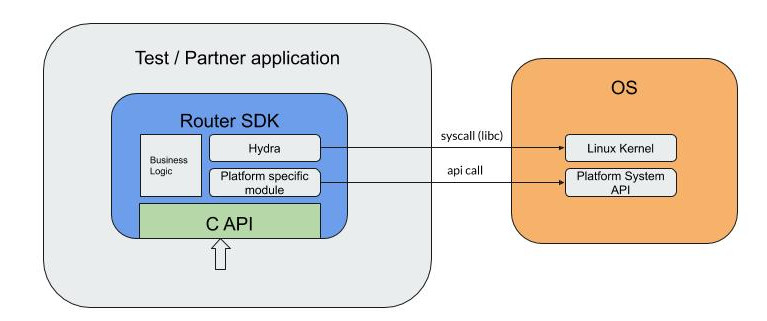

# HydraVPN SDK for Routers

## Overview

Router SDK is a part of Pango Platform which contains client-side libraries and server-side applications needed to implement custom VPN infrastructure.

Router SDK provides a shared library \(with C header file\) and can be integrated with Application using C calls.



## Core features

Router SDK can intercept traffic for individual devices \(src IP based routing\) and route it to a specific VPN server \(multi-server, multi-country\). SDK notifies the Application about important events using a callback mechanism.


## SDK C API

**int afwrt\_init\(const char \*params\_json\);**

Initialize library. Must be called once before using the library.

Example parameters string:

```text
{
 "ping_interval": 30,
 "debug_log": 0,
 "redirect_port": 8082,
 "data_report_interval": 10000,
 "enable_tcp_tproxy": 1
}
```

**Ping\_interva**l, seconds -- time interval between ping packets library sends to router clients.

**Debug\_log** -- turn library debug logs on/off.

**Redirect\_port** -- port to redirect VPN traffic to, listened by Hydra.

**Data\_report\_interval**_,_ milliseconds -- time interval between bandwidth events \(see callback section below\).

**Enable\_tcp\_tproxy** -- TCP transparent proxy usage. 1 -- use, 0 -- do not use \(TCP traffic from protected clients will go to tun iface\).

**`int afwrt_deinit(void);`**

Deinitialize library. Must be called once after using the library.

**`int afwrt_start(void (*event_callback)(const char *event_str), const char *backend, const char *token);`**

Start library event loop.

**Event\_callback** -- function to be called by the library on event \(see callback section below\).

**Backend** -- string, specifies partners API backend to use. Example: "[https://backend.northghost.com](https://backend.northghost.com/)"

**Token** -- partners API auth token.

**`int afwrt_stop(void);`**

_Stop library event loop._

**`char * afwrt_get_available_countries(int *err /* out, may be NULL */);`**

Returns json string with list of available VPN locations, or NULL on error. String must be free\(\)-ed by the caller.

**Err** -- pointer to pass error code on error.

VPN locations string example: \[ "br", "ca", "de", "fr", "gb", "it", "jp", "mx", "us" \]

**`char * afwrt_get_platform_info(int *err /* out, may be NULL */);`**

Returns json string with platform information, or NULL on error. String must be free\(\)-ed by the caller.

**Err** -- pointer to pass error code on error.

Platform information string example:

```text
{
  "board": {
    "model": "Linksys WRT1200AC",
    "system": "ARMv7 Processor rev 1 (v7l)"
  },
  "clients": [
    {
      "dhcp_name": "",
      "ipv4": "192.168.1.2",
      "mac": "01:01:01:01:01:01"
    }
  ],
  "fw": {
    "last_update": "Wed Jan 30 12:21:02 2019\n",
    "rev": "r7676-cddd7b4c77"
  },
  "wan_connected": true,
  "wifi": {
    "interfaces": [
      {
        "enc": "none",
        "isolate": false,
        "mode": "ap",
        "radio_id": "radio0",
        "section": "default_radio0",
        "ssid": "test5"
      },
      {
        "enc": "none",
        "isolate": true,
        "mode": "ap",
        "radio_id": "radio0",
        "section": "hss0535790",
        "ssid": "guest"
      }
    ]
  }
}
```

**`int afwrt_protect_mac_addr(const char *mac_addr, const char *country);`**

Route traffic from device with specified MAC address via specified VPN country. Returns AFWRT\_OK on success, error code on error.

**Mac\_addr** -- string representation of MAC address, example: "D4:81:D7:F7:49:54".

**Country** -- VPN location string, example: "us". See afwrt\_get\_available\_countries\(\).

**`int afwrt_unprotect_mac_addr(const char *mac_addr);`**

Remove rules to route traffic from device with specified MAC address via VPN. Returns AFWRT\_OK on success, error code on error.

**Mac\_addr** -- string representation of MAC address, example: "D4:81:D7:F7:49:54".

**`int afwrt_protect_ip_addr(const char *addr, const char *country);`**

Route traffic from specified IP address via specified VPN country. Returns AFWRT\_OK on success, error code on error.

**addr** -- string representation of IP address, example: "192.168.1.152".

**Country** -- VPN location string, example: "us". See afwrt\_get\_available\_countries\(\).

**`int afwrt_unprotect_ip_addr(const char *addr);`**

Remove rules to route traffic from specified IP address via VPN. Returns AFWRT\_OK on success, error code on error.

**addr** -- string representation of IP address, example: "192.168.1.152".

**`int afwrt_protect_ssid(const char *section, const char *country);`**

Route traffic from wifi clients connected to specified wifi network via specified VPN country. Returns AFWRT\_OK on success, error code on error.

**Section** -- section id of wifi network \(not ssid!\), example: "hss0535790". See afwrt\_get\_platform\_info\(\).

**Country** -- VPN location string, example: "us". See afwrt\_get\_available\_countries\(\).

**`int afwrt_unprotect_ssid(const char *section);`**

Remove rules to route traffic from wifi clients connected to specified wifi network via VPN. Returns AFWRT\_OK on success, error code on error.

**Section** -- section id of wifi network \(not ssid!\), example: "hss0535790". See afwrt\_get\_platform\_info\(\).

**`int afwrt_protect_ethernet(const char *country);`**

Route traffic from ethernet clients via specified VPN country. Returns AFWRT\_OK on success, error code on error.

**Country** -- VPN location string, example: "us". See afwrt\_get\_available\_countries\(\).

**`int afwrt_unprotect_ethernet(void);`**

Remove rules to route traffic from ethernet clients via VPN. Returns AFWRT\_OK on success, error code on error.

**VPN rules priority**

Per-network \(ssid, ethernet\) rules have higher priority than per-device \(mac address / ip address\). For example, there are following rules:

* route ethernet traffic via “jp”
* route traffic from device with MAC address "02:02:02:02:02:02" via “us”

Device with MAC address "02:02:02:02:02:02" is connected to a router ethernet LAN port. Then traffic from that device will be routed via “jp” VPN country.

## Callback events

Callback function is called on connection information events and on bandwidth events. JSON string is passed to the callback to provide event details. Each event has 2 fields: "event" with event type, and "params" with event details.

**HYDRA\_SD\_ROUTE\_CONNECTED**

This event is sent when one of the routes gets connected.

_Example:_

```text
{
  "event": "HYDRA_SD_ROUTE_CONNECTED",
  "params": {
    "route_name": "it"
  }
}
```

_“route\_name” will contain route name that successfully established connection._

**HYDRA\_SD\_ROUTE\_FAILED**

This event is sent when one of the routes fails to establish connection.

_Example:_

```text
{
  "event": "HYDRA_SD_ROUTE_FAILED",
  "params": {
    "reason_details": "connection failed",
    "route_name": "fr"
  }
}
```

_“route\_name” will contain route name that failed._

_"reason\_details" string with error description._

**HYDRA\_SD\_ROUTE\_FALLBACK**

This event is sent when secondary route fails and fallback route \(usually main route or other explicitly specified\) is used.

_Example:_

```text
{
  "event": "HYDRA_SD_ROUTE_FALLBACK",
  "params": {
    "fallback_route_name": "us",
    "route_name": "fr"
  }
}
```

_“route\_name” specifies route that failed._

_“fallback\_route\_name” specifies fallback to be used._

**HYDRA\_SD\_ROUTE\_DISCONNECTED**

This event is sent when active route has lost connection due to network condition or for the other external reason. Disconnect requested by afwrt\_stop is not reported.

_Example:_

```text
{
  "event": "HYDRA_SD_ROUTE_DISCONNECTED",
  "params": {
    "reason_details": "unable to restore connection",
    "route_name": "fr"
  }
}
```

_“route\_name” will contain route name that has disconnected._

_"reason\_details" string with error description._

**HYDRA\_SD\_BANDWIDTH**

Event is sent periodically to client application. See afwrt\_init\(\), “data\_report\_interval”.

_Example:_

```text
{
  "event": "HYDRA_SD_BANDWIDTH",
  "params": {
    "bandwidth_info": [
      {
        "data_interval_ms": 100,
        "n_points": 100,
        "points_downstream": 0,
        "points_upstream": 0,
        "route_name": "br"
      },
      {
        "data_interval_ms": 100,
        "n_points": 100,
        "points_downstream": 0,
        "points_upstream": 0,
        "route_name": "ca"
      },
      {
        "data_interval_ms": 100,
        "n_points": 100,
        "points_downstream": 0,
        "points_upstream": 0,
        "route_name": "de"
      },
      {
        "data_interval_ms": 100,
        "n_points": 100,
        "points_downstream": 0,
        "points_upstream": 0,
        "route_name": "fr"
      },
      {
        "data_interval_ms": 100,
        "n_points": 100,
        "points_downstream": 0,
        "points_upstream": 0,
        "route_name": "gb"
      },
      {
        "data_interval_ms": 100,
        "n_points": 100,
        "points_downstream": 0,
        "points_upstream": 0,
        "route_name": "it"
      },
      {
        "data_interval_ms": 100,
        "n_points": 100,
        "points_downstream": 0,
        "points_upstream": 0,
        "route_name": "jp"
      },
      {
        "data_interval_ms": 100,
        "n_points": 100,
        "points_downstream": 0,
        "points_upstream": 0,
        "route_name": "mx"
      },
      {
        "data_interval_ms": 100,
        "n_points": 100,
        "points_downstream": 0,
        "points_upstream": 253,
        "route_name": "us"
      }
    ]
  }
}
```

## Intercepting FORWARD traffic for specific device\(IP\)

SDK configures Linux kernel submodules to intercept FORWARD traffic for specific device IP.

SDK creates TUN device and routes all packets with specific src IP to this virtual interface:

_\# ip rule_

_32765: from 192.168.1.2 lookup 47_

_\# ip route show table 47_

_default dev tun-hss_

Hydra VPN reads IP packets from this TUN device, process and sends data to the VPN server.

  
If “enable\_tcp\_tproxy” \(see **afwrt\_init\(\)**\) is set to 1, SDK terminates TCP traffic locally using Transparent Proxy:

_iptables -t nat --insert PREROUTING -i br-lan -p tcp --source 192.168.1.2 ! --destination 192.168.1.1 -j REDIRECT --to-ports 8082_

Transparent Proxy works usually faster than TUN interface and utilizes less CPU.

Hydra VPN reads TCP stream from local socket, processes and sends data to the VPN server.

## MAC to IP address resolution

To be able to distinguish device traffic on L3 SDK needs its IP address.

SDK maintains internally mapping between MAC and IP addresses. It periodically checks Linux ARP table and sends ping packets to connected clients to refresh ARP table.

## Dependencies

OpenWRT package dependencies:

**libc**, **jansson**, **zlib**, **kmod-tun**, **ca-bundle**, **libubox**, **libubus**, **libuci**, **libnetfilter-conntrack**.

