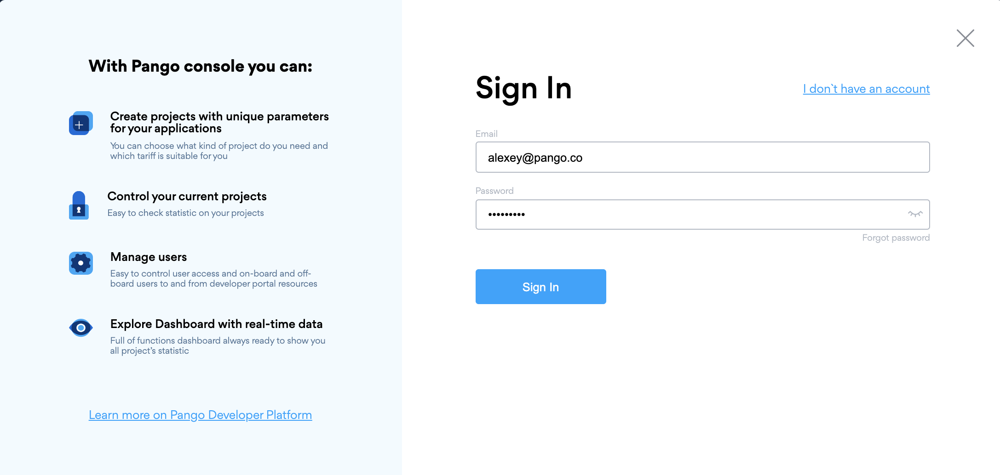
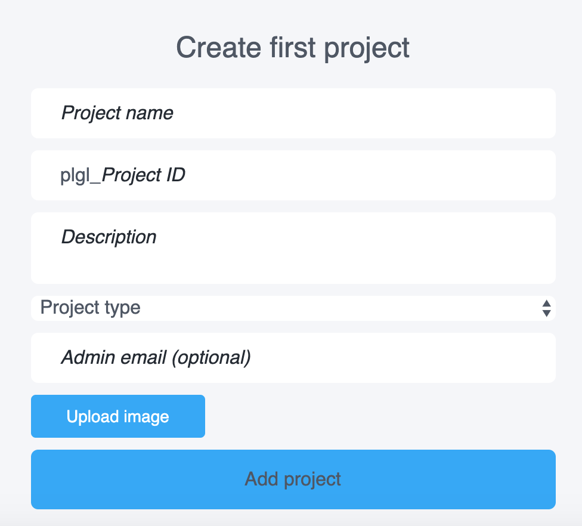
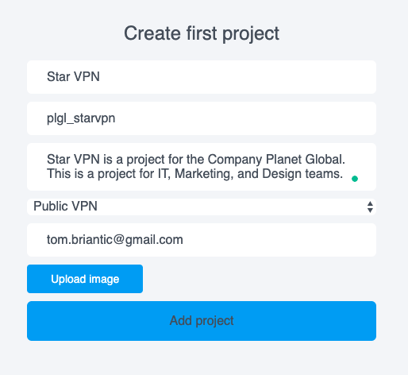
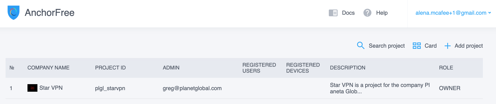
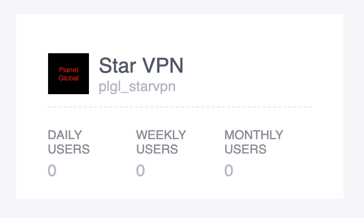

# Create a new Project

**Adding a new project to the Management Console**

1. Open [https://developer.anchorfree.com/](https://developer.anchorfree.com/#)
2. Click Sign in button
3. Enter your valid creds and click ‘Sign In’ button: 

As a result, you will be redirected to the ‘Create first project’ page:

4. Fill all available fields:

* **Project name**. It should be a unique name; it can contain Latin characters and numbers. This field is mandatory.
* **Project ID.** The ID should be unique; it can contain Latin characters and numbers. Project ID is also called a carrier. This field is mandatory.
* **Description.** It is a description of the project, e.g. its purpose or target audience. This field is mandatory.
* **Project type** drop-down menu**.** This field is mandatory.
* Public VPN option is for consumer apps \(B2C\).
* Private VPN option is for SMB and Enterprise customers.
* Proxy option - It is a test functionality \(in development\).

* **Admin email.** The admin \(i.e. the person who creates the project\) is the project owner. He has full access to the project.
* **Upload image** button**.** Using this button, you can upload a project icon that will be displayed near the project name. This is optional.

Here is an example of a filled ‘Create first project’ form:

5. Click **Add project** button

Next, you will see your created project in projects list view:

Or in project cards view:

**How to configure recently added project to Management Console** 

1. Add a list of locations:

    2. Add a list of project users:



