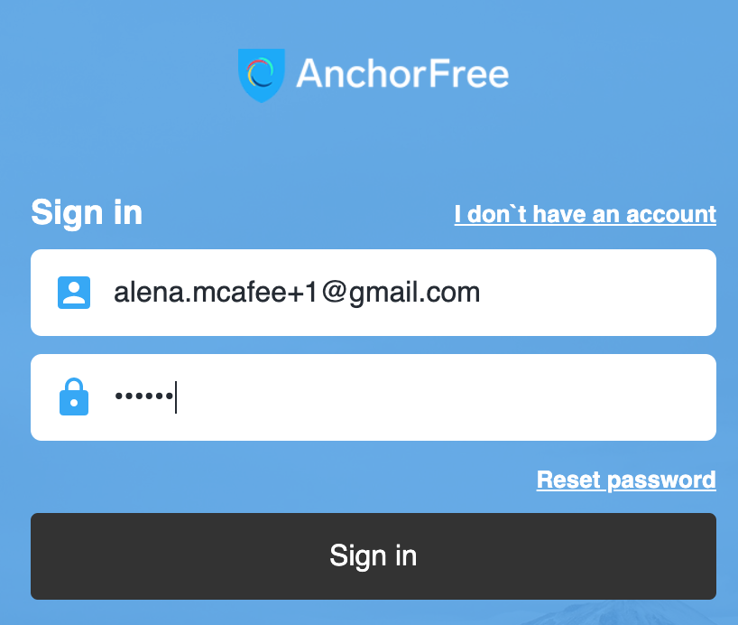
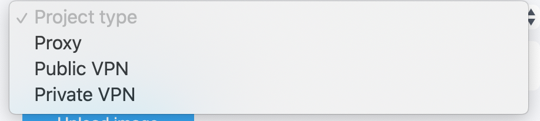

# Create the new Project

**How to add the new project to Developer Portal**

1. Open [https://developer.anchorfree.com/](https://developer.anchorfree.com/#) web page
2. Click Sign in button
3. Enter your valid creds and click ‘Sign in’ button:

As a result, you redirect to ‘Create first project’ page:

4. Fill out all available fields:

* **Project name field**. It should be a unique name for the project that can contain Latin characters and numbers. It is a mandatory field.
* **Project ID field.** It should be a unique ID for the project that can contain Latin characters and numbers, another name for Project ID is a carrier. It is a mandatory field.
* **Description field.** It is a field that describes information about the project, for example purposes of the project, the target audience. It is an optional field.
* **Project type drop-down menu.** It is a mandatory field.
* Public VPN option is for consumer apps \(B2C apps\).
* Private VPN option is for SMB and Enterprise customers.
* Proxy option - It is test functionality \(under development\).

* **Admin email field.** The owner is the person who creates the project. The admin role has access to the project.
* **Upload image button.** It is a project icon that displays close to the project name and the project ID. It is an optional option.

As a result, you get completed ‘Create first project’ form:

5. Click ‘Add project’ button

As a result, you can find your created project \(the projects list view\) or project cards:

As a result, you can find your created project \(project cards view\):

**How to configure recently added project to Developer Portal**

1. Add a list of locations:



    2. Add a list of project users: 



