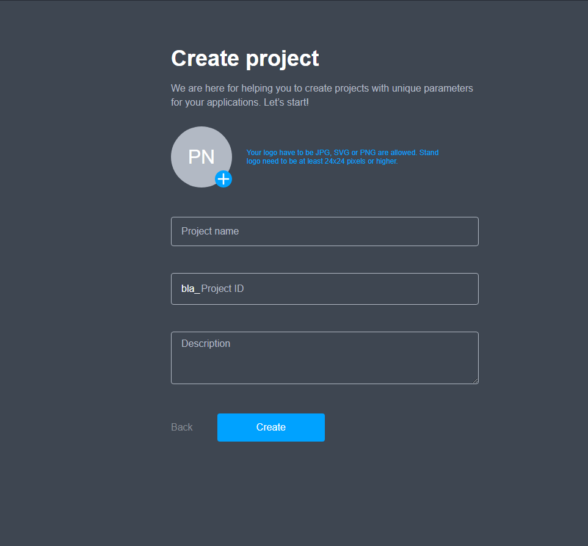

# Create a new Project

**Adding a new project to the Management Console**

1. Open [https://developer.aura.com/](https://developer.aura.com/)
2. Click 'Sign In'
3. Enter your valid creds and click ‘Sign In’ button: 

As a result, you will be redirected to the ‘Create first project’ page:

4. Fill all available fields:

* **Project name**. It should be a unique name; it can contain Latin characters and numbers. This field is mandatory.
* **Project ID.** The ID should be unique; it can contain Latin characters and numbers. Project ID is also called a carrier. This field is mandatory.
* **Description.** It is a description of the project, e.g. its purpose or target audience. This field is mandatory.
* **Admin email.** The admin \(i.e. the person who creates the project\) is the project owner. He has full access to the project.
* **Upload image** button**.** Using this button, you can upload a project icon that will be displayed near the project name. This is optional.

5. Click **Create**

Next, you will see your project's dashboard:


Since your new project is still unconfigured, there will not be much information in the dashboard.


**How to configure recently added project to Management Console** 

1. Add a list of locations:



    2. Add a list of project users:



