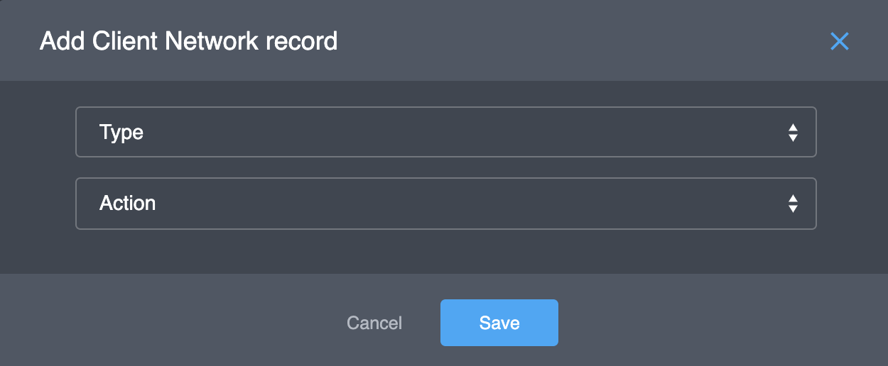
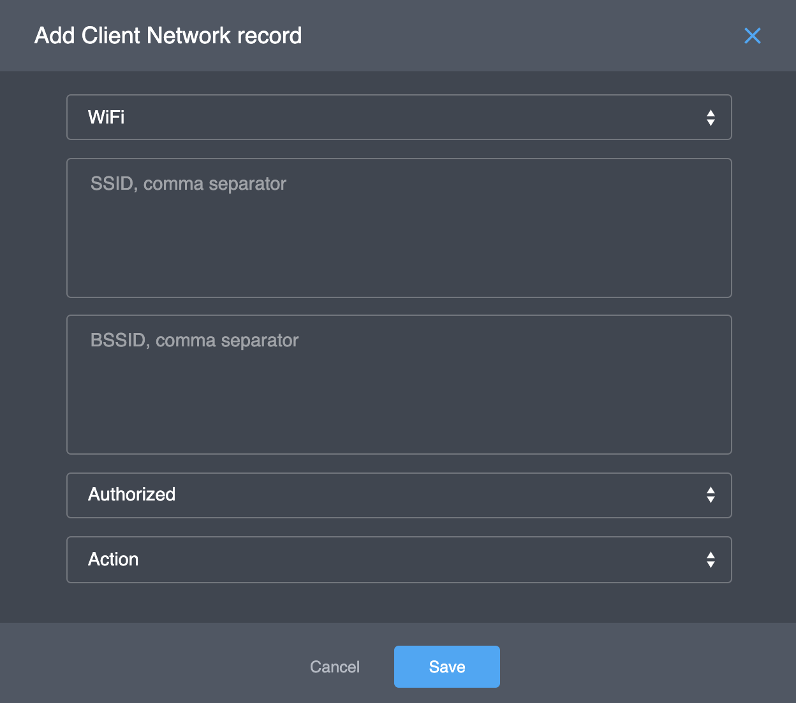
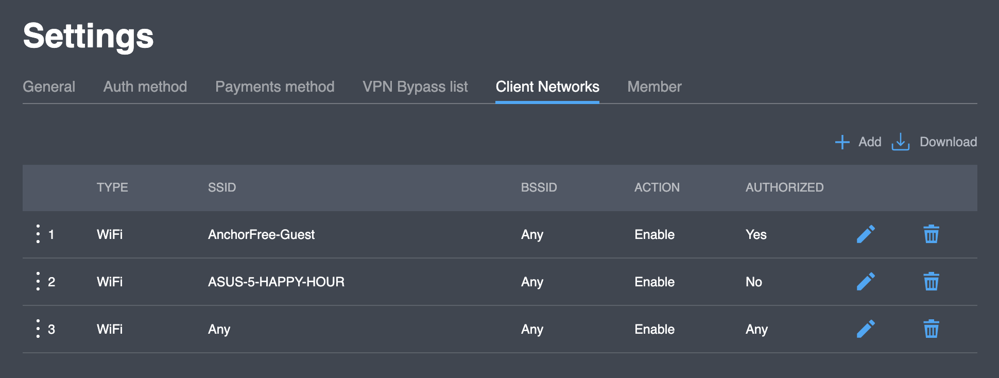

# Client Networks

By setting up a network with this feature, the VPN will be automatically turned on or off depending on what rule is set for the network. 

You can create and menage the list of rules for all your users in this tab.

## **Actions**

### **Adding a rule**

If you are going to add new network rule to the project you need to do next steps:

1. Click button "**Add**". You will see the new form like this:

  2. Select Type of Network.  The options are _WIFI_, _WWAN_ \(Mobile Phone Network\) or _LAN_ \(Ethernet\). If _WIFI_ is chosen, another dialog will appear:  

* Enter the SSID \(Name of the WiFi network\)  or the BSSID \(MAC address of the Wi-Fi network\). Optional field.
* Authorized \(If the network has a password or not\) options are _Yes_, _No_ or "_Does not matter_".
* Finally, pick the Action option. Either select _enable_ or _disable_, to automatically turn on the VPN \(enable\) or turn off the VPN when this network is used.

  3. Click **Save** button to add new rule. Like result you will see the new rule in the list of rules like this:

### **Download list of rules**

Selecting this option will cause the list of networks to be downloaded as a JSON file onto your device.

### **Editing a rule**

Just select the  pencil to the right of the name of the network that you want to modify. Make sure to click on save after any changes.

### **Deleting a rule**

Click on the  trash can  that is right of the network that needs to be deleted.

### **Priority of rules**

In the picture below, the BobsNetwork is on the first line as well as the second.  The way the system works, the higher on this list the higher the priority the rules of the network are given.  In this situation, BobsNetwork will have the VPN enabled and will ignore the second line where it disables the VPN.

**Changing order of the Network**

The order of these networks can be easily changed.  Just select the number of the network on the far left and drag it to the new location.

