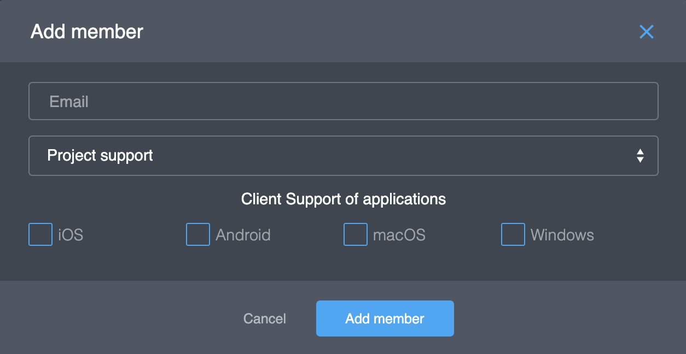
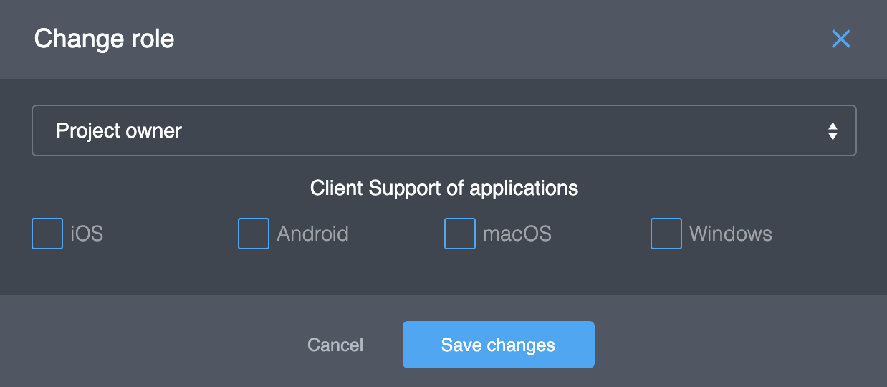

# Member

The Project Member is a person who has access to the Platform Console. There are 3 roles of the members with different access:

| Role | Access  | Description |
| :--- | :--- | :--- |
| Owner | full access | who made the project |
| Admin |  |  |
| Support |  |  |

## Actions

### Adding a new member

If you are going to add new member to the project you need to do next steps:

1. Click button "**Add member**". You will see the new form like this:

  2. Enter the email address of the user.


If this user has access to the Platform Console, he will see this project in his list of projects. If this user is new, the Platform will send the invite.


  3. Select a member role. 


A member can't add a new member with a role above himself.


  4. If this new member will respond to questions from other users concerning issues with the client, select the clients that the user will receive emails from.


our SDK provides this member-email to an application \(per OS\). Your application can use this email for support contact.


  5. Click button "**Add member**".

### Editing a member

If you going to change settings of an existed member, you need to do next steps:

1. Select a member and click the button "". You will see the new form like this:  

  2. Edit setting and click the button "**Save changes**". 

### Deleting a member

If you going to delete an existed member, you need to do next steps:

1. Select a member for delete and click the button "". You will see the new form like this:  

   2. Click the button "**Delete member**". 

