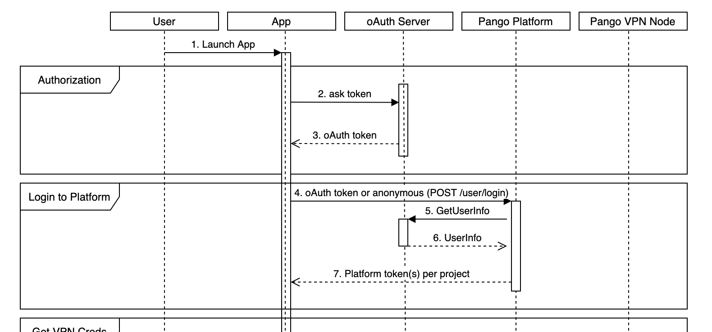

# Auth Plugin requirements

We can make a plugin for any authentication service compatible with the next flow: 



This is piece of the full Flow diagram:



_**oAuth Server**_ - you User authentication service.

_**App**_ - your application with ours SDK

**1 Phase \(Authorization\)**: A user authentication in oAuth Server. The result is the App gets an oAuth token \(1-3 steps\).

**2 Phase \(Login to Platform\)**: 

**Step 4**: The App call POST __`/user/login` method \(or call login method of ours SDK\) with  the parameter "_auth\_method_" = you plugin name and "_access\_token_" = oAuth token. 

**Step 5**: The Platform verify this oAuth token in your oAuth Server. In this flow we call "GetUserInfo \(_oauth\_token\)"_ method \(the name can be changed\). __You should provide this method for us.

**Step 6**: The example of the response this method: 

```text
{ 
  "result": "OK", 
  "user": 
    { 
      "uid": 690109944 
    } 
}
```

or

```text
{ 
  "result": "Not found" 
}
```

If user oAuth token verification successful we get "result": "OK" and additional user information, for example, UID in your side. If user oAuth token verification failed we get "result": "Not exist" or any similar response. 

**Step 7**:  If verification failed the Platform return the error code:

```text
{
  "result": "OAUTH_ERROR",
  "error": "failed login"
}
```

 If verification successful the Platform registered user and his device in the project. Process registration can include set specific user parameters like - _Traffic_, _License_, _Status_, _Extref_, _Description_, _User country_ \(it depends on your application logic\)_._ See description of these parameters:




