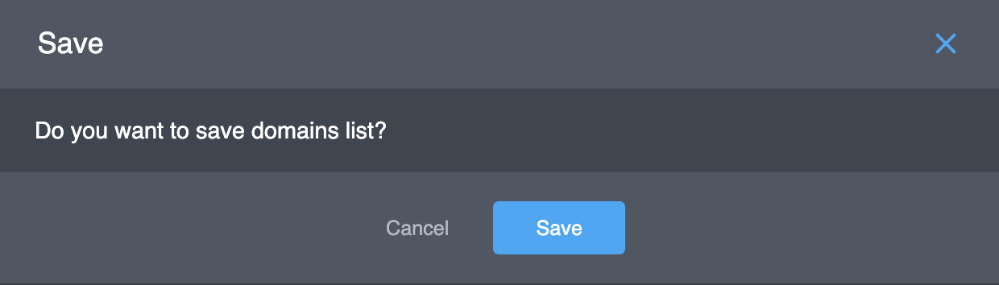
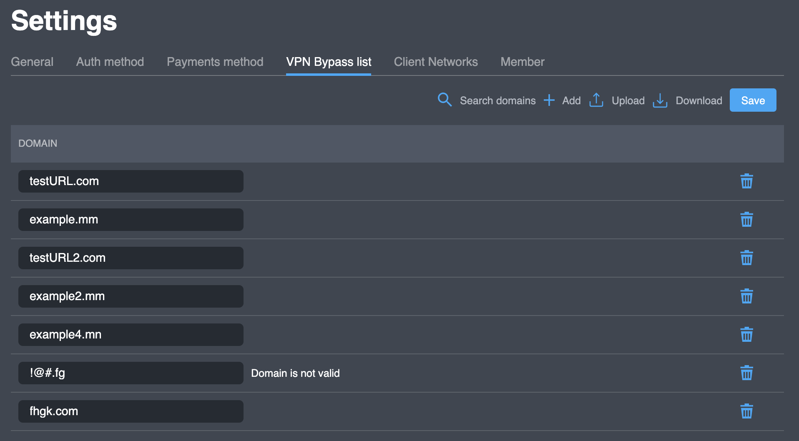

# VPN Bypass list

Some traffic \(by domain\) can go to the internet directly outside the VPN tunnel.  To access the feature, add domains to this Bypass list.

## Actions

### Manually adding a Single domains

If you are going to add one domain to the Bypass list of you project you need to do next steps:

1. Click button "**Add**". A new line without a domain will be generated in the list of domains.


  2. Enter the domain and then click on the **Add** button. The domain will then be moved to the bottom of the list.


 You can use special characters "\*". Example: 

* `*.google.com` — all domains google.com
* `*.exploit.*` — all domains containing the`exploit`string



if your domain will be incorrect, you will see the error message "**Domain is not valid**".  


  3. Repeat step 2 and 3 for other domains 

  4. Select the **Save** button so that the changes that were made are retained. As a result, you will see the form for approval new Bypass list.  



  5. Click the button **Save** for approval all changes you new VPN Bypass list. Like result you will see the form with the result of the Bypass list changes like this:  


  6. You can close it \(click the button "**Close**"\) or download this log \(click the button "**Download**"\).

### **Adding Multiple domains**

  1. To add multiple domains, generate a text file with domains on each line. For example:

```text
testURL2.com
example2.mm
example4.mn
!@#.fg
fhgk.com
```

  2. Click on  **Upload** and select the text file. You will see all domains in your Bypass list:




if any domain is incorrect, you will see the error message "**Domain is not valid**" \(see domain _!@\#.fg_ in the screenshot\).


  3. Select the **Save** button so that the changes that were made are retained. As a result, you will see the form for approval new Bypass list.  


  5. Click the button **Save** for approval all changes you new VPN Bypass list. Like result you will see the form with the result of the Bypass list changes like this:   



The incorrect domain not included to the new Bypass list \(see screenshot\).


  6. You can close it \(click the button "**Close**"\) or download this log \(click the button "**Download**"\).

### **Deleting a domain**

  1. Click on the trash can that is one the line of the site that needs to be removed. 

  2. Select the **Save** button so that the changes that were made are retained. As a result, you will see the form for approval new Bypass list.  


  5. Click the button **Save** for approval all changes you new VPN Bypass list. Like result you will see the form with the result of the Bypass list changes like this:   


  6. Click the button "**Close**".

### **Search**

If there are a large number of domains in the bypass list, the**Search domains** feature can be used to determine if the domain already exists in the list.

### **Download** 

If a list of the bypass is desired, click on  **Download** and the list of the domains will be downloaded to your device.

