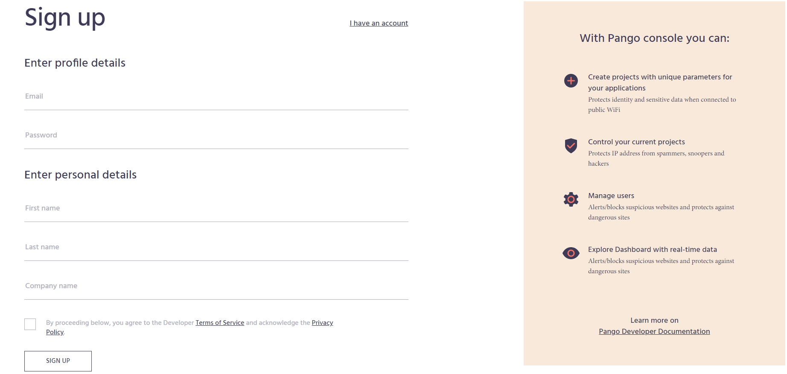
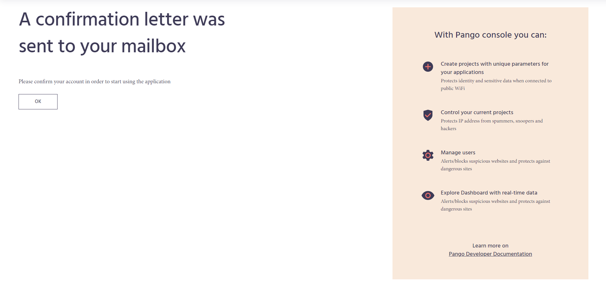
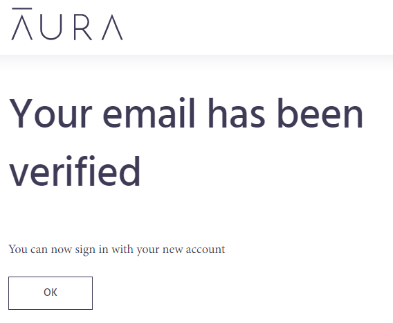

# Sign Up to Management Console

### **How to create a new account on Management Console**

1. Open [https://developer.aura.com/](https://developer.aura.com/)
2. Click the 'Sign up' button in the top-right corner:

The 'Sign up' form will appear on the screen:


Before you fill the form, please take a minute to read and agree \(if applicable\) with our cookies usage policies. It is necessary for our platform to use cookies in order to provide better user experience.


3.  Fill out the form. All fields are mandatory:

* **Email -** an email address, it should be valid and unique; notifications from the platform will be sent there.


If the email address provided is not unique, the following error message will be displayed: **This email address was already registered**


* **Password -** a ****reliable password for your account; it can contain Latin characters, special symbols, and numbers.
* **First name -** your first name for the account; it can contain Latin characters and numbers.
* **Last name -** your last name for the account; it can contain Latin characters and numbers. 
* **Company name -** your company name; it can contain Latin characters, special symbols and numbers \(e.g. _Planet Global_\).
* Check the **Terms of Service/Privacy Policy box**.

4. Click on the **SIGN UP** button bellow the form.

5. Next screen will appear after a successful processing of the form:

6. Click on the **OK** button.

7. Check your email box, a sign-up confirmation letter with the subject 'Verify your email for Pango PaaS' should arrive shortly:

8. Follow the link in the email in order to verify your address.

9. You should receive a notification that your email has been verified as a result:


Now you are ready to log in to the Management Console and create your first project. Please, follow to the next article on how to create a new project.


