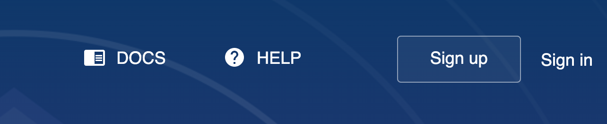
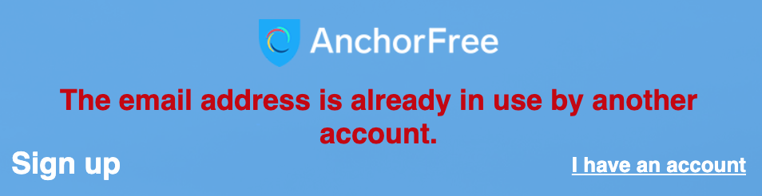
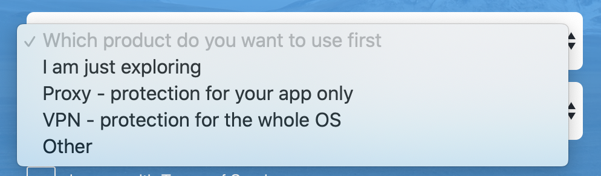
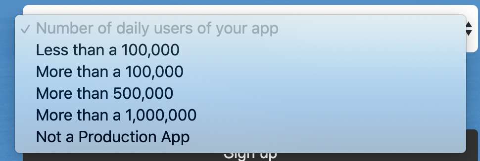
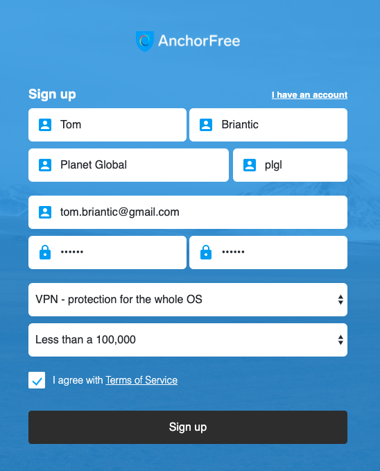
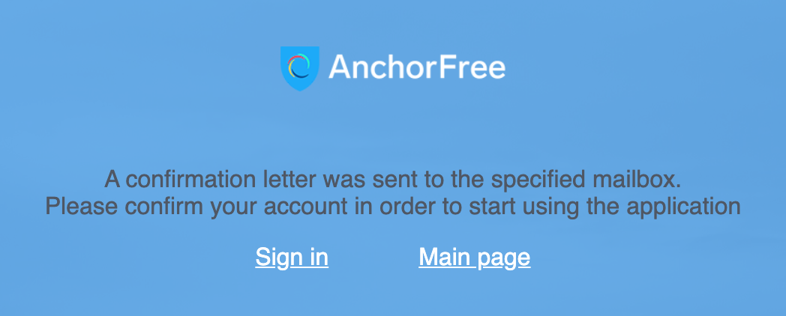
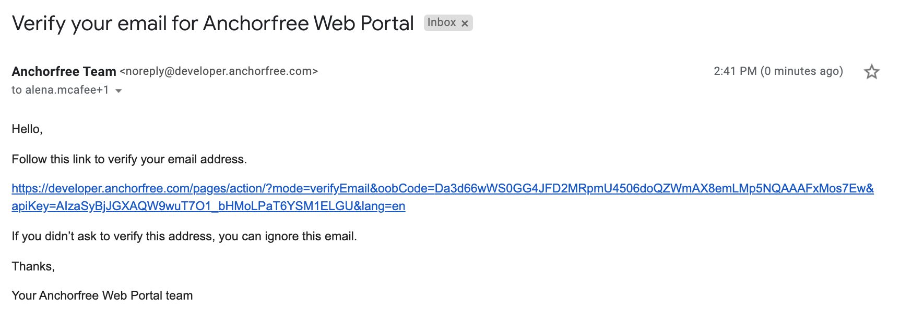
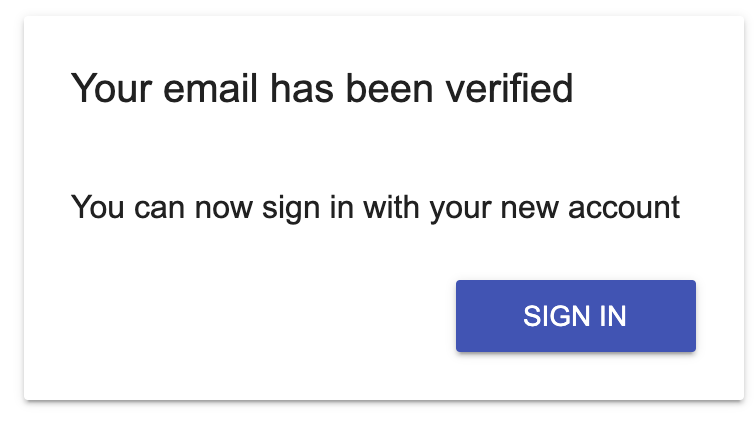

# Sign Up to Management Console

**How to create a new Developer account on Management Console \(AnchorFree\)**

1. Open [https://developer.anchorfree.com](https://developer.anchorfree.com/#)
2. Click the ‘Sign up’ button in the top-right corner:

As a result, you see the ‘Sign up’ form:

3.  Fill out all available fields:

* **First name** field. Your first name for the account; it can contain Latin characters and numbers. This field is mandatory.
* **Last name** field. Your last name for the account; it can contain Latin characters and numbers. This field is mandatory.
* **Company name** field. Your company name; it can contain Latin characters, special symbols and numbers \(e.g. _Planet Global_\). This field is mandatory.
* **Company code** field. The company code; it can contain Latin characters and numbers \(e.g. _plgl_\). It is a prefix for projects that you can add to the Management Console. This field is mandatory.
* **Email** field. The address should be valid and unique; letters from the Management Console will be sent there. The field is mandatory.

If the address is not unique, the following error message will be displayed:

* **Choose password** field. A reliable password for your account; it can contain Latin characters, special symbols and numbers. The field is mandatory.
* **Repeat password** field. The password should be the same as in the 'Choose password' field. The field is mandatory.
* **Which product do you want to use first** drop-down menu. Choose an item that best matches your purpose. The field is mandatory.

* **Number of daily users of your app** drop-down menu. Choose an item that best matches your purpose. The field is mandatory.

* **I agree with Terms of Service** checkbox. It is a mandatory checkbox.

As a result, you get completed ‘Sign up’ form:

4.   Click the **Sign up** button

As a result, you see a message:

5.   After this, you receive an email with the subject ‘Verify your email for Anchorfree Web Portal’:

6.  Click the link in the email:

And you receive a notification that your email has been verified:

\*\*\*\*

