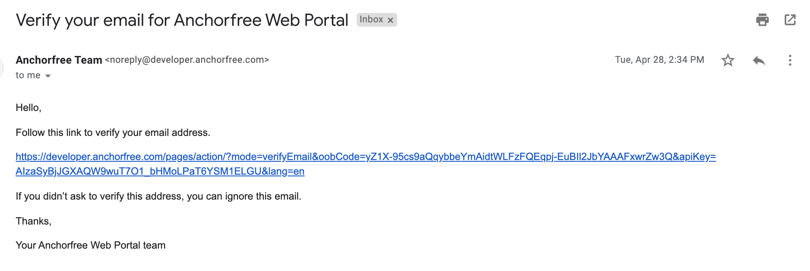

# Sign Up to Developer console

**How to create a new Developer account on Management Console \(AnchorFree\)**

1. Open [https://developer.anchorfree.com](https://developer.anchorfree.com/#) web page
2. Click the ‘Sign up’ button in the right side of the website:

As a result, you get ‘Sign up’ form:

3.  Fill out all available fields:

* **First name field.** It should be your first name for the account that can contain Latin characters and numbers. It is a mandatory field.
* **Last name field.** It should be your last name for the account that can contain Latin characters and numbers. It is a mandatory field.
* **Company name field.** It should be the company name where you work or own The field can contain Latin characters, special symbols and numbers, for example _Planet Global_. It is a mandatory field.
* **Company code field.** It should be the company code that can contain Latin characters and numbers, for example _plgl_. It is a prefix for future projects that you can add to the Developer Portal. It is a mandatory field.
* **Email field.** It should be an actual, valid email address to get emails from the Developer Portal. It is a mandatory field. It isn't possible to use the email address that is already connected with the existing account on Developer Portal.

As a result, you get the error message:

* **Choose password field.** It should be a complex password for your account that can contain Latin characters, special symbols and numbers. It is a mandatory field.
* **Repeat password field.** It should be the same password as in the Choose Password field. It is a mandatory field.
* **Which product do you want to use first drop-down menu.** One of the items should be chosen that matches best for your account. It is a mandatory field.

* **Number of daily users of your app drop-down menu.** One of the items should be chosen that matches best for your account. It is a mandatory field.

* **I agree with Terms of Service checkbox.** It is a mandatory checkbox that should be accepted.

As a result, you get completed ‘Sign up’ form:

4.   Click ‘Sign up’ button

As a result, you get the text:

5.   Verify the email address that you entered in the form earlier. You can find an email with ‘Verify your email for Anchorfree Web Portal’ subject:

6.  Click the link from email:

As a result, you get ‘Your email has been verified’ popup:

\*\*\*\*

